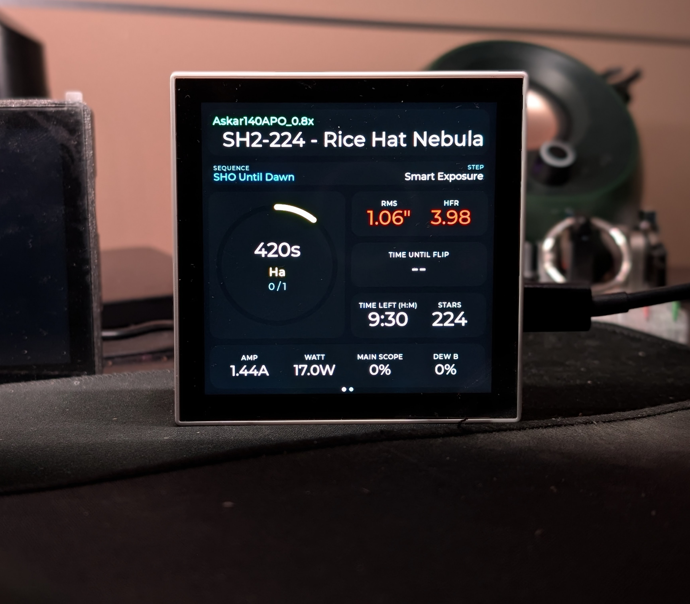
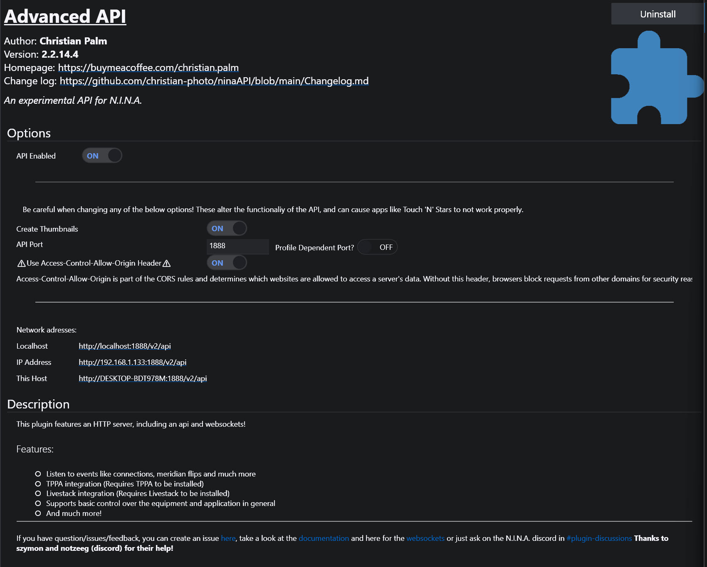
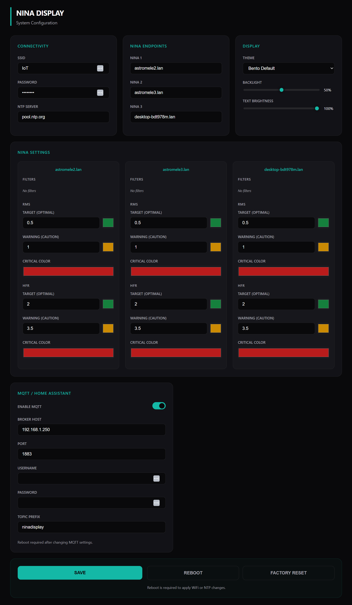
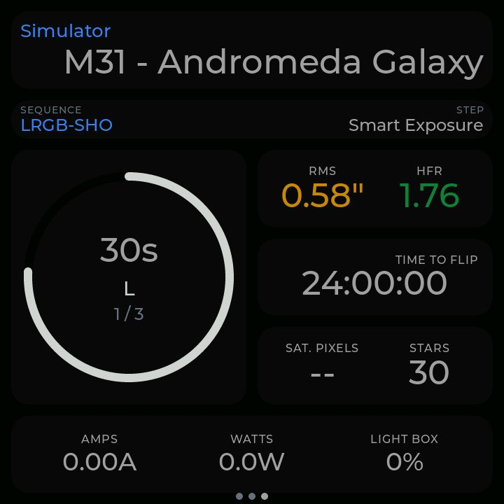
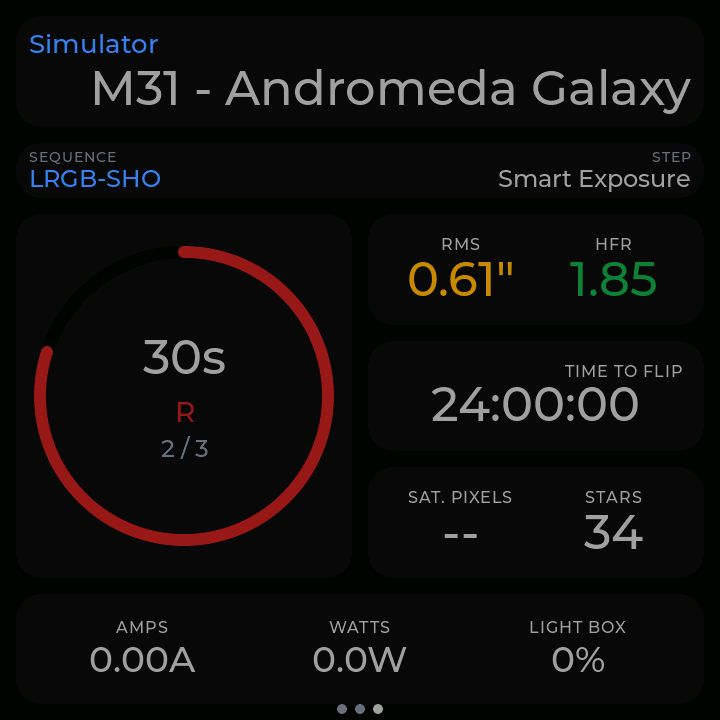
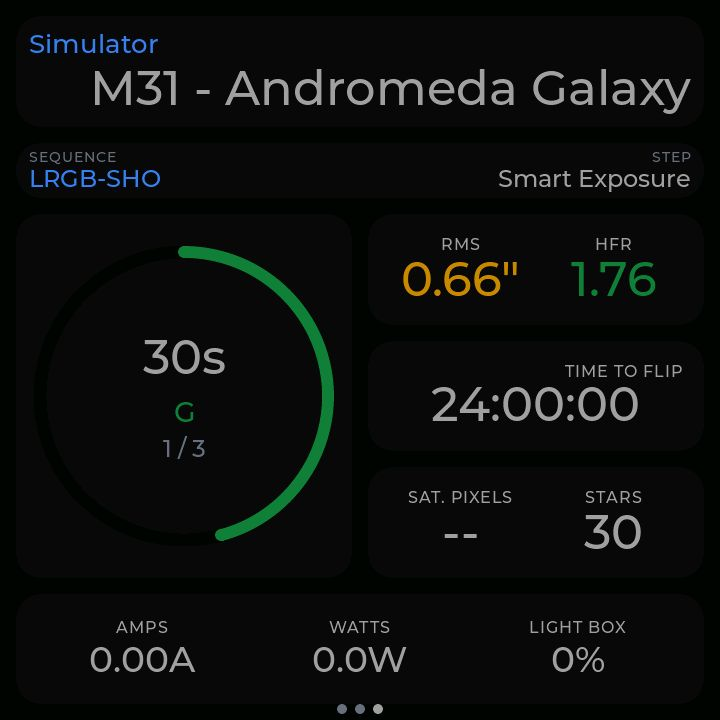
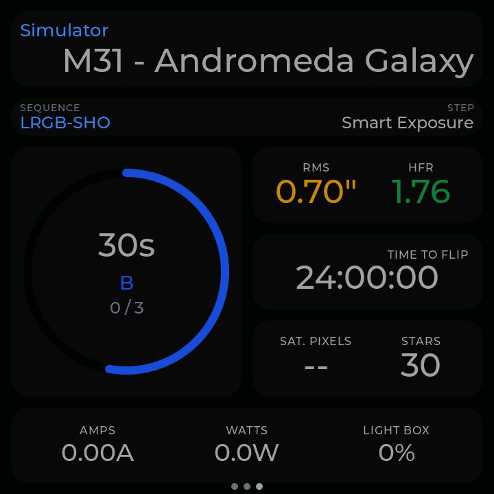
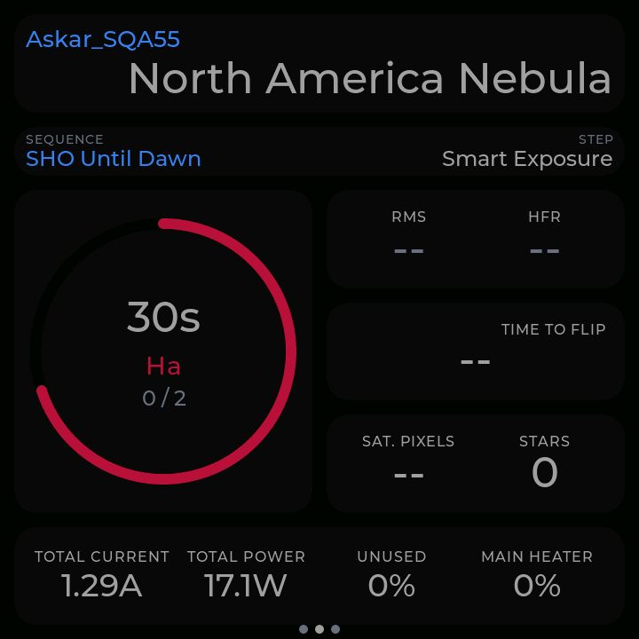
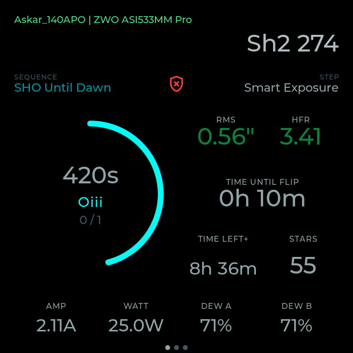
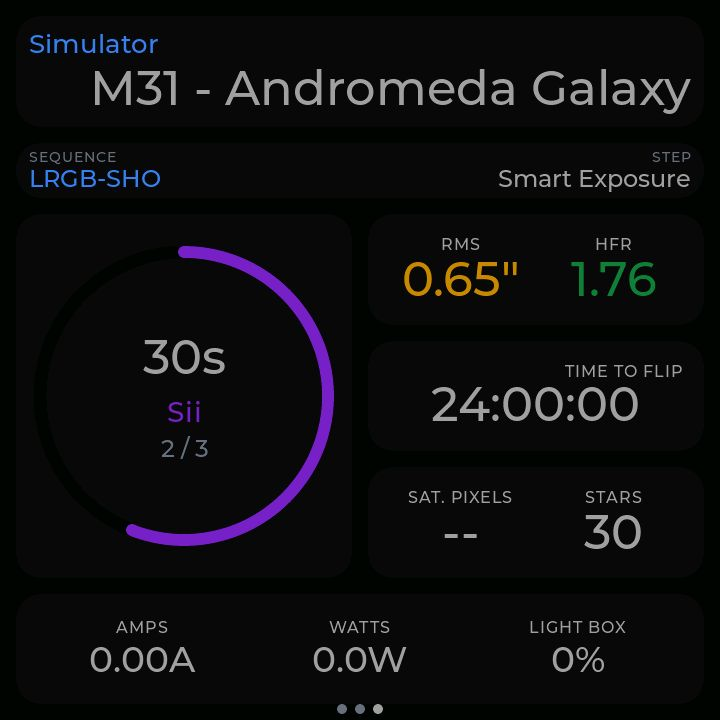

# ESP32-P4 NINA Display

A touchscreen dashboard for [N.I.N.A. astrophotography software](https://nighttime-imaging.eu/), built for the **Waveshare ESP32-P4-WIFI6-Touch-LCD-4B** (720×720). It polls the [ninaAPI Advanced plugin](https://github.com/christian-photo/ninaAPI) over HTTP and WebSocket to show your session state in real time—exposure arcs, guiding RMS, filter status, power draw, and more. Monitor up to three separate N.I.N.A. instances from a single device.

<p align="center">
  
</p>

---

## Prerequisites

### Hardware

- **[Waveshare ESP32-P4-WIFI6-Touch-LCD-4B](https://www.waveshare.com/esp32-p4-wifi6-touch-lcd-4b.htm?sku=31416)** — this is the only tested board. The layout is tuned for its 720×720 display.

### Software (on the N.I.N.A. PC)

- [N.I.N.A. Nighttime Imaging 'N' Astronomy](https://nighttime-imaging.eu/)
- [ninaAPI Advanced plugin](https://github.com/christian-photo/ninaAPI) by Christian Palm — install it from N.I.N.A.'s plugin manager, then enable it. The display talks to this plugin exclusively.

<p align="center">
  
</p>

---

## Installation

Download the latest release from the [Releases page](../../releases) and follow the release notes for flashing instructions. No build environment needed for a standard install—just a browser and the Waveshare flash tool or `esptool`.

> **Watch out:** If your board shows warnings on the serial console about an outdated `esp-hosted` co-processor firmware, erase the ESP32-C6 coprocessor and flash `network_adapter.bin` at address `0x0000` from the release page. The firmware in this project embeds an OTA update for the C6..

---

## First-Time Setup

The device always broadcasts a WiFi access point named **`AllSky-Config`** (no password). Connect to it from your phone or laptop, then open `http://192.168.4.1` in a browser to reach the config page.

<p align="center">
  
</p>

Set at minimum:

1. **WiFi credentials** — your observatory/home network where NINA runs.
2. **NINA API URL(s)** — e.g. `http://192.168.1.50:1888/v2` for each instance you want to monitor. You can configure up to three.

Hit Save. The device reconnects to your network and starts polling immediately.

> **Pro-tip:** The config AP stays active even after the device joins your network. You can reconfigure at any time without rebooting or pressing anything.

---

## What's on the Display

Each NINA instance gets its own page. Swipe left/right or press the **BOOT button** to switch between them. A row of dots at the bottom shows which page you're on.

**Per-page data:**

| Section | Data shown |
|---|---|
| Header | Target name, telescope, profile name, WiFi signal bars, connection status dot |
| Exposure arc | Animated arc sized to exposure progress; color follows the active filter |
| Filter & timing | Active filter name, elapsed / remaining time |
| Sequence | Container name, current step, loop counter |
| Guiding | Total RMS, RA RMS, DEC RMS (arcseconds); color shifts at configurable thresholds |
| Image stats | HFR, star count, saturated pixel count from the last frame |
| Mount | Time to meridian flip |
| Power | Input voltage (V), total current (A), total power (W), PWM percentages for dew heaters |

**Tap the target name / header area** to pull a full-screen JPEG preview of the last captured image. The ESP32-P4's hardware JPEG decoder handles this—it's fast. Tap anywhere to dismiss.

A small pulsing dot in the header indicates an API request is in flight. When it's solid and colored, you're connected. When it fades to grey, NINA isn't reachable.

---

## Multi-Instance Support

Add a second or third API URL in the config page. Each one gets its own dashboard page. During a session, only the **active (visible) page** gets full 2-second polling. Background instances get a 10-second heartbeat to check connectivity without hammering the API.

**Auto-rotate** lets the display cycle through instances automatically on a configurable interval, with optional skip for disconnected instances. Configure it from the web UI under Display Settings.

---

## Themes & Filter Colors

14 built-in dark themes are available—select one from the web config. Each theme colors the static UI chrome; the dynamic elements (exposure arc, guider values) pick up their colors from per-filter settings.

Filter colors are configured per-instance as hex values. When NINA reports a filter name the device hasn't seen before, it adds it with a default color you can then customize. Colors also drive the RMS and HFR threshold indicators—set your acceptable limits, and values outside range shift from white to amber to red.

---

## MQTT / Home Assistant Integration

Enable MQTT in the web config and point it at your broker. The device publishes discovery configs so N.I.N.A. session sensors appear automatically in Home Assistant. It also exposes display brightness as a controllable entity, so you can dim the screen from an HA automation during a dark-site session.

---

## System Info Page

Swipe past the last NINA page to reach a system info screen showing device IP address, hostname, WiFi SSID/RSSI, free heap, CPU frequency, and uptime. Useful for confirming the device is on the right network after first setup.

---

## Screenshots

Dashboard with various active filters:

<p align="center">
  
</p>

<p align="center">
  
</p>

<p align="center">
  
</p>

<p align="center">
  
</p>

<p align="center">
  
</p>

<p align="center">
  
</p>

<p align="center">
  
</p>

---

## Building from Source

This is a standard **ESP-IDF** project targeting IDF 5.5.x. You need the IDF toolchain installed and `IDF_PATH` set.

```bash
# Activate IDF environment (once per terminal session)
. $IDF_PATH/export.sh

# Build
idf.py build

# Flash and open monitor
idf.py flash monitor

# Wipe the build directory if you hit component cache issues
idf.py fullclean
```

Dependencies are managed via **IDF Component Manager** (`idf_component.yml`). Don't edit files under `managed_components/` directly—run `idf.py update-dependencies` if you need to refresh them.

> **Pro-tip:** If you get linker errors after pulling new commits, `idf.py fullclean && idf.py build` fixes most of them. Component updates sometimes leave stale artifacts that confuse the incremental build.

### Key source files

| File | What it does |
|---|---|
| `main/main.c` | Boot sequence, WiFi init, task spawning, JPEG decode |
| `main/tasks.c` | Polling loop, WebSocket lifecycle, thumbnail fetch |
| `main/nina_client.h/.c` | NINA REST API + WebSocket client |
| `main/app_config.h/.c` | NVS-backed config (WiFi, URLs, themes, thresholds) |
| `main/web_server.h/.c` | On-device HTTP config UI |
| `main/mqtt_ha.h/.c` | MQTT + Home Assistant discovery |
| `main/ui/nina_dashboard.h/.c` | LVGL widget tree, swipe gestures, thumbnail overlay |
| `main/ui/nina_sysinfo.h/.c` | System info page |
| `main/ui/themes.h/.c` | 14 built-in dark themes |

All LVGL calls require the display mutex:

```c
lvgl_port_lock(0);
// ... LVGL API calls ...
lvgl_port_unlock();
```

Miss this and you'll get intermittent crashes that are genuinely painful to track down.
