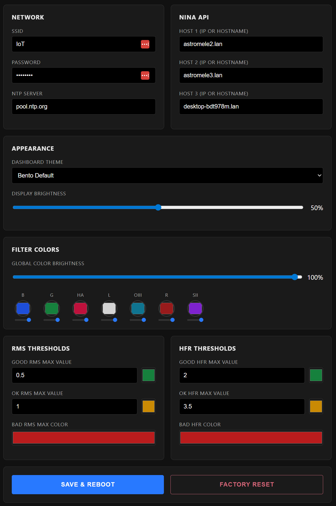

# ESP32-P4 NINA Display

## Description

ESP32P4 based dashboard for N.I.N.A. running on the Waveshare ESP32-P4-WIFI6-Touch-LCD-4B. The application connects to the N.I.N.A. API via WiFi to retrieve and display real-time astrophotography session data. It uses LVGL to render the interface.

## Features

The dashboard monitors critical parameters of an imaging session, including:

*   **Session Information:** Target name, Telescope name, Profile name.
*   **Sequence Progress:** Active sequence container, current step name, loop counts.
*   **Exposure Status:** Real-time exposure progress bar, remaining time, and filter wheel status.
*   **Guiding Performance:** Total RMS error, RA RMS, and DEC RMS in arcseconds.
*   **Image Statistics:** HFR (Half-Flux Radius), Star count, and Saturated pixel count from the latest image.
*   **Mount Status:** Time remaining until Meridian Flip.
*   **Power Monitoring:** Input voltage, total current (Amps), total power (Watts), and PWM output percentages (e.g., Dew Heaters).
*   **Multi-Instance Support:** Monitor up to three separate N.I.N.A. instances simultaneously.
*   **Navigation:** Swipe gestures to switch between different N.I.N.A. instance views.
*   **Connectivity:** Uses WebSockets for low-latency event updates (e.g., image save, filter change).

## Software Requirements
* NINA
* NINA [Advanced API plugin](https://github.com/christian-photo/ninaAPI) by Christian Palm

NOTE: If your ESP32P4 shows warnings on serial console about old version on the esp-hosted co-processor, erase the device using the same website mentioned in the release and then flash the `network_adapter.bin` at 0x0000 from the release page. This firmware has embedded OTA update for the ESP32C6 co-processor that will update it to the latest firmware built by ESP-IDF 5.5.2. This is the same version of ESP-IDF that was used to build the firmware in this project.

  

## Hardware Requirements

*   ESP32-P4 Development Board with Display (e.g., 720x720 resolution recommended for the current layout).

    * https://www.waveshare.com/esp32-p4-wifi6-touch-lcd-4b.htm?sku=31416
    * https://www.amazon.com/Waveshare-ESP32-P4-WIFI6-Touch-LCD-4B-External-Dual-Core-Single-Core/dp/

  

## Screenshots

Web config page:

  

The following images demonstrate the dashboard interface with different filter configurations:

  

  

  

  

  

  

  

## Installation

Please refer to the Release Notes for detailed installation instructions.
