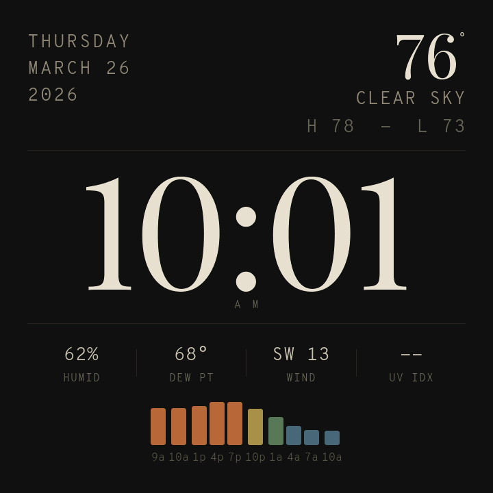

<h1 align="center">
   ESP32-P4 NINA Display
</h1>

<p align="center">
  <a href="https://github.com/chvvkumar/ESP32-P4-NINA-Display/actions/workflows/build.yml?query=branch%3Amain"></a>
  <a href="https://github.com/chvvkumar/ESP32-P4-NINA-Display/actions/workflows/build.yml?query=branch%3Adev"></a>
</p>

<p align="center">
  <a href="https://github.com/chvvkumar/ESP32-P4-NINA-Display/releases/latest"></a>
  <a href="https://github.com/espressif/esp-idf/tree/v5.5.2"></a>
  <a href="https://lvgl.io/"></a>
</p>

<p align="center">
  
  
  
  
</p>

A touchscreen dashboard for [N.I.N.A. astrophotography software](https://nighttime-imaging.eu/), built for the Waveshare ESP32-P4-WIFI6-Touch-LCD-4B (720x720). It polls the [ninaAPI Advanced plugin](https://github.com/christian-photo/ninaAPI) over HTTP and WebSocket and shows live session data for up to three NINA computers: exposure arcs, guiding RMS, filter status, sequence progress, power draw, and a Summary page across all instances. Beyond NINA it runs a clock with weather and a 3D moon, a Spotify Now Playing screen, an AllSky environmental panel, GOES satellite, Solar and custom image pages, an animated Weather Radar loop, a Cloud Cover satellite loop, JSON Display and Home Assistant tile pages, and an OctoPrint 3D printer page. Voice alerts through the onboard speaker announce threshold breaches, connection changes and session events.

<table align="center">
  <tr>
    <td align="center"></td>
    <td align="center"></td>
  </tr>
</table>

## Table of Contents

- [Hardware](#hardware)
- [Installation](#installation)
- [First-Time Setup](#first-time-setup)
- [Security](#security)
- [Pages](#pages)
  - [Summary and NINA Instance Pages](#summary-and-nina-instance-pages)
  - [Clock, Weather and Moon](#clock-weather-and-moon)
  - [Spotify](#spotify)
  - [AllSky](#allsky)
  - [GOES Satellite](#goes-satellite)
  - [Solar](#solar)
  - [Custom Image URL](#custom-image-url)
  - [Weather Radar](#weather-radar)
  - [Cloud Cover](#cloud-cover)
  - [JSON Display](#json-display)
  - [Home Assistant](#home-assistant)
  - [OctoPrint](#octoprint)
  - [On-Device Settings and System Info](#on-device-settings-and-system-info)
- [Navigation and Home Page](#navigation-and-home-page)
- [Themes](#themes)
- [Notifications and Voice Alerts](#notifications-and-voice-alerts)
- [Web UI](#web-ui)
- [Web API](#web-api)
- [Power and Display](#power-and-display)
- [Diagnostics](#diagnostics)
- [Building from Source](#building-from-source)
- [Troubleshooting](#troubleshooting)
- [Acknowledgements](#acknowledgements)

## Hardware

- [Waveshare ESP32-P4-WIFI6-Touch-LCD-4B](https://www.waveshare.com/esp32-p4-wifi6-touch-lcd-4b.htm?sku=31416): currently the only tested board. The layout is tuned for its 720x720 display.
- [3D Printed Stand](https://www.thingiverse.com/thing:7321463) (optional): a printable stand for the display, designed by [@chicago925](https://github.com/chicago925) ([#116](https://github.com/chvvkumar/ESP32-P4-NINA-Display/issues/116)).
- [3D Printed Mount](https://www.printables.com/model/1784141-waveshare-esp32-p4-wifi6-touch-lcd-4b-mount) (optional): a printable desk mount for the display, designed by the project author.

<p align="center">
  
</p>

## Installation

1. On the N.I.N.A. PC, install the [ninaAPI Advanced plugin](https://github.com/christian-photo/ninaAPI) by Christian Palm from the N.I.N.A. plugin manager and enable it. The display cannot work without it.

<p align="center">
  
</p>

2. Download `nina-display-factory.bin` from the [Releases page](https://github.com/chvvkumar/ESP32-P4-NINA-Display/releases). No build environment is needed: open the [ESP Web Flasher](https://espressif.github.io/esptool-js/) in a Chromium-based browser, connect the board over USB, and flash the file at address `0x0000`. Each release includes step-by-step flashing instructions.

3. Later updates arrive over the air. In the web UI, open Device > System > Firmware, pick an update channel (**Stable only**, **Include pre-releases**, or **Alpha (snd)**), and select **Check for Updates** then **Install Update**. **Check for updates on boot** automates the check. Manual Update flashes a `.bin` you upload from your computer. If a new firmware fails to boot, the bootloader rolls back to the previous one.

> [!NOTE]
> If the board warns about outdated esp-hosted co-processor firmware, flash [`firmware/merged-flash.bin`](firmware/) to the ESP32-P4 at address `0x0000`. It updates the ESP32-C6 WiFi co-processor over the internal link and shows progress on screen. When it finishes, flash `nina-display-factory.bin` again.

## First-Time Setup

1. On first boot, or whenever WiFi is not connected, the device broadcasts an access point named after its hostname (default `NINA-DISPLAY`, password `12345678`) and prints the network name and address on screen. Join it and open `http://192.168.4.1`.
2. The setup page asks for your WiFi network. Save; the device joins your network and shows its address and hostname on screen until you dismiss the hint.
3. Open that address, log in (see [Security](#security)), and add your NINA computers on Pages > N.I.N.A.: enter the host or IP of each PC (up to three); the page adds port 1888 and the API path for you.

The access point is only on while the station link is down. Once the device joins your network the AP switches off; it comes back if the connection drops.

## Security

The web UI is protected by a password login (default `changeme123!`, no username). Change it on first use: Device > System > Authentication > Admin Password.

- Login is required by default for every page and API endpoint. A session lasts 12 hours.
- Scripts and automation can skip the login form and send the password in an `X-Auth-Password` header on each request. Wrong passwords on either path feed the same lockout.
- WiFi and MQTT passwords, the Spotify client ID, the OctoPrint API key, the weather API key, the JSON auth header and the Home Assistant token are returned as `********` by the API; sending that placeholder back leaves the stored value unchanged.
- Transport is HTTP, not HTTPS. Treat your LAN segment as the trust boundary.

> [!WARNING]
> **Require login to access the web UI** can be turned off on the System tab. With it off, every endpoint is open to anyone on the LAN, including reboot, factory reset and firmware update. Use only on trusted networks.

## Pages

Every page can be enabled or disabled from the web UI; the Clock, Summary and Settings pages are always present. Data pages that talk to a server show a "Connecting to ..." state until the first successful fetch, dim with a "Reconnecting..." cue after missed polls, and switch to "Cannot Reach ..." after three misses.

### Summary and NINA Instance Pages

The Summary page shows a card for each configured NINA instance: name, active filter, target, sequence step and progress, RMS, HFR, safety state, and time to meridian flip. Tap a card to jump to that instance's page.

Each instance page is a 720x720 grid: header (instance name, colored green when connected and red when not, and the current target), sequence, an animated exposure arc colored by the active filter, filter and timing, guiding RMS, image stats (HFR, star count), mount flip time, session time, and power (voltage, current, watts, dew-heater PWM). After 30 s without fresh data a Last update label appears; after 2 minutes the page dims.

Setup: Pages > N.I.N.A.: host or IP per instance, filter colors, RMS and HFR thresholds, data update rate (1-10 s), connection timeout, idle poll interval.

<p align="center">
  
</p>

<table align="center">
  <tr>
    <td align="center"></td>
    <td align="center"></td>
  </tr>
  <tr>
    <td align="center"><em>Instance page, Ha filter</em></td>
    <td align="center"><em>Instance page, OIII filter</em></td>
  </tr>
</table>

Every section on an instance page is tappable:

| Tap area | Opens |
|---|---|
| Header | Full-screen JPEG preview of the last captured image (tap to dismiss) |
| Sequence box | Sequence detail overlay (container, step, exposure counts) |
| Exposure arc | Camera and weather overlay (camera name, temperature, dew point, humidity, pressure) |
| Filter label (arc center) | Filter wheel overlay (current and available filters) |
| RMS box | RMS history graph (up to 500 points, RA/Dec/Total, threshold lines) |
| HFR box (short tap) | HFR history graph (up to 500 points, threshold lines) |
| HFR box (long press) | Autofocus overlay (V-curve, focus position) |
| Flip time box | Mount overlay (RA/Dec, altitude, azimuth, meridian flip state) |
| Session time box | Session statistics overlay (total exposures, imaging time, target altitude, dawn) |
| Stars box | Image statistics overlay (star count, HFR, FWHM, eccentricity, SNR) |
| Power row | Jump back to the Summary page |

<table align="center">
  <tr>
    <td align="center"></td>
    <td align="center"></td>
  </tr>
  <tr>
    <td align="center"><em>Autofocus overlay</em></td>
    <td align="center"><em>Image statistics overlay</em></td>
  </tr>
  <tr>
    <td align="center"></td>
    <td align="center"></td>
  </tr>
  <tr>
    <td align="center"><em>RMS history graph</em></td>
    <td align="center"><em>HFR history graph</em></td>
  </tr>
</table>

Polling: the visible instance is polled at the data update rate (default 2 s); the other instances get a 10 s heartbeat. While the Summary page is showing, all instances are polled at full rate. While a page other than a NINA page is showing, every instance drops to the idle poll interval (default 30 s) and the WebSocket connections close.

### Clock, Weather and Moon

The Clock page shows a large analog or digital clock with current conditions, high and low, humidity, dew point, wind, UV, and hourly forecast bars from your chosen provider. The Moon page renders the Moon on the device with the current phase, libration and sub-solar lighting; drag it to look around, and pick a starfield or glow background.

Setup: Pages > Clock: **Weather Provider** (**OpenWeatherMap**, **Open-Meteo (no key needed)**, or **Weather Underground**), API key where required, temperature units, time format, update interval (15-60 min). The location comes from Device > System > Location (city lookup or latitude and longitude). Moon: Pages > Moon: **Enable Moon page**, refresh interval, background, drag lighting, orientation.

<p align="center">
  
</p>

<table align="center">
  <tr>
    <td align="center"></td>
    <td align="center"></td>
  </tr>
  <tr>
    <td align="center"><em>Plain black background</em></td>
    <td align="center"><em>Starfield + Glow background</em></td>
  </tr>
</table>

### Spotify

A full-screen Now Playing page with album art, track and artist, progress bar, and playback controls that appear on tap. Data comes from the Spotify Web API through your own Spotify developer app.

Setup: Pages > Spotify:

1. Create a free app at [developer.spotify.com](https://developer.spotify.com).
2. Set its redirect URI to `http://127.0.0.1:8000/callback`.
3. Paste the **Client ID** into the Spotify tab.
4. Select **Login with Spotify** and approve access; the client ID is saved automatically.
5. The browser lands on a page that cannot load. Copy the full address from the address bar, paste it into **Redirect URL**, and select **Submit**.

Options: poll interval, **Minimal Mode**, **Show Overlay**, **Scroll Long Text**, **Show Progress Bar**, overlay timeout.

<table align="center">
  <tr>
    <td align="center"></td>
    <td align="center"></td>
  </tr>
  <tr>
    <td align="center"><em>Now Playing</em></td>
    <td align="center"><em>Controls overlay</em></td>
  </tr>
</table>

### AllSky

A four-quadrant environmental panel (thermal, sky quality, ambient, power) fed from an AllSky camera's `/all` endpoint. Each quadrant maps to fields of the AllSky JSON, with thresholds that color the readings.

Setup: Pages > AllSky: **Enable AllSky**, **AllSky Hostname**, update interval (1 s to 5 min), dew point safety margin; select **Fetch JSON from AllSky** to import the field list, then assign fields under Quadrant Mappings.

<p align="center">
  
</p>

### GOES Satellite

Full-screen GOES satellite imagery for a chosen region, refreshed on an interval.

Setup: Pages > GOES: **Enable GOES page**, **Region**, update interval (5 min to 2 h).

Options: **Show Overlay** (caption), **Fill (crop borders)**, **Rotation**, **Flip vertical**, **Flip horizontal**.

<p align="center">
  
</p>

### Solar

Full-screen NASA SDO and SOHO solar imagery in a chosen band (AIA wavelengths, HMI continuum and magnetogram, LASCO coronagraphs, EIT).

Setup: Pages > Solar: **Enable Solar page**, **Band**, update interval (5 min to 2 h).

Options: **Show Overlay**, **Fill (crop borders)**, **Rotation**, **Flip vertical**, **Flip horizontal**.

<p align="center">
  
</p>

### Custom Image URL

Full-screen JPEG or PNG fetched from any URL you supply, for example a webcam or a weather map.

Setup: Pages > Custom URL: **Enable Custom URL page**, **Image URL**, update interval (10 s to 2 h).

Options: **Show Overlay**, **Fill (crop borders)**, **Rotation**, **Flip vertical**, **Flip horizontal**.

### Weather Radar

An animated NWS radar loop for a chosen radar site, a region, the whole CONUS, or the nearest site to your location. Choose how many frames to keep, the refresh interval, an optional caption, **Crop** (drops the NOAA header and legend), and **Dark mode**. **Map style** picks what the radar echoes are drawn over: **Standard (roads and city names)**, **State lines only** (the default), or **State and county lines**. The two line-only styles remove roads and labels, which helps when highway markings look like heavy rain. Crop and Dark mode apply only to the Standard style; the Red Night theme recolors all three.

Setup: Pages > Radar: **Enable Weather Radar page**, **Radar area** (**Automatic (nearest radar to my location)** uses the Location on the System tab), update interval (2 min to 2 h), **Animation length** (1-10 frames).

<p align="center">
  
</p>

### Cloud Cover

An animated satellite loop of the cloud cover around your location, from NOAA GOES imagery served by NASA. Day: true color. Night: infrared clouds over city lights. State and country borders and major roads are drawn over the picture. The satellite (GOES-East or GOES-West) is picked from your longitude. The source updates every 10 minutes and the newest frame is usually 30-45 minutes old.

Setup: Pages > Cloud Cover: **Enable Cloud Cover page**, **Area** (about 150 km to 2500 km across), update interval (5 min to 2 h), **Animation length** (1-10 frames), **Show Overlay**. The location comes from Device > System > Location.

<p align="center">
  
</p>

### JSON Display

A tile grid over any JSON document reachable by URL: each tile shows one value picked from the response, with a label and unit.

Setup: Pages > JSON: **Enable JSON Display**, **JSON URL**, optional **Auth Header**, poll interval (5 s to 5 min). Select **Fetch JSON** to import keys from a live response, build the layout row by row, and **Preview Layout on Device** before saving.

<p align="center">
  
</p>

### Home Assistant

A tile grid over Home Assistant entity states, fetched per entity from the HA REST API. This is separate from the MQTT integration described under [Web UI](#mqtt-and-home-assistant-discovery), which publishes the display's own controls to Home Assistant.

Setup: Pages > Home Assistant: **Enable Home Assistant page**, **Base URL**, **Long-Lived Access Token**, poll interval (5 s to 5 min). **Test Connection** checks the token, then build the tile layout and **Preview Layout on Device**.

### OctoPrint

Shows the current print from an OctoPrint server: progress, layer, time elapsed, estimated finish, and nozzle and bed temperatures. Choose one of four layouts. The picture is either the thumbnail your slicer embeds in the G-code file or a snapshot from the printer camera. The display only reads from OctoPrint; it never sends commands to the printer.

Setup: Pages > OctoPrint: **Enable OctoPrint page**, **OctoPrint Address**, then **Authenticate** to approve the display from OctoPrint (or paste an **API Key**), update interval.

Options: **Page Layout** (**Grid**, **Immersive image**, **Floating overlay**, **Letterbox**), **Show readings over picture**, **Image** (**G-code preview (from slicer)** or **Camera snapshot**), **Camera Snapshot Address**.

<p align="center">
  
</p>

<table align="center">
  <tr>
    <td align="center"></td>
    <td align="center"></td>
  </tr>
  <tr>
    <td align="center"><em>Grid</em></td>
    <td align="center"><em>Immersive image</em></td>
  </tr>
  <tr>
    <td align="center"></td>
    <td align="center"></td>
  </tr>
  <tr>
    <td align="center"><em>Floating overlay</em></td>
    <td align="center"><em>Letterbox</em></td>
  </tr>
</table>

Each layout can show the printer camera instead of the slicer preview. Nozzle and bed readings change color with what the heater is doing: warming up, holding at target, cooling down, or off. Tapping the page hides the readings so only the picture shows; the Grid layout is unaffected.

### On-Device Settings and System Info

Swipe to the Settings page for on-device configuration in four tabs: Display, Nodes, Behavior, and System (including Reboot and Factory Reset). The web UI exposes the full set of options. The System Info page reports IP, WiFi signal, CPU, memory, PSRAM, uptime, and task count.

Setup: none.

<table align="center">
  <tr>
    <td align="center"></td>
    <td align="center"></td>
  </tr>
  <tr>
    <td align="center"><em>On-device Settings</em></td>
    <td align="center"><em>System Info</em></td>
  </tr>
</table>

## Navigation and Home Page

Swipe left or right to change pages, or press the BOOT button on the board to advance (it skips the Settings page). Page-indicator dots at the bottom mark the NINA instance pages.

The display picks a page on its own; a swipe or tap takes over for the **Stay on selected page** time (10-300 s, default 10), after which it returns to its automatic choice. All of these controls live on Device > Behavior > Page Navigation:

- **Home Page**: the page the display settles on when nothing else applies. When it is a NINA instance, the display also returns there whenever that instance is online. With several instances online and a non-NINA Home Page, the display shows the Summary page.
- **Always show the Home Page**: keep the Home Page on screen even while instances are connected.
- **Auto Cycle**: rotate through the ticked **Pages in Rotation** in the order shown, with an **Interval** of 4-3600 s, a **Transition** of **Instant**, **Fade**, **Slide Left** or **Slide Right**, and **Skip disconnected nodes**. For pages that download a picture, the countdown starts once the picture has loaded, and image pages fetch a fresh picture each time the rotation reaches them.
- **Switch page when no connections**: show a chosen **Target page** while every enabled NINA instance is confirmed disconnected, with an optional **Show idle indicator** dot.

The web Home page and the API can also send the display to any page; see [Web API](#web-api).

## Themes

Nine built-in dark themes (Default, Red Night, Cyber Dusk, Stellar Ember, Arctic Steel, Oxidized Copper, Solar Flare, Phantom Green, Bloodmoon), selectable on Device > Display > Appearance; changes apply instantly. **Widget Style** picks one of 13 panel treatments (Subtle Border, Frosted Glass, Chamfered, Scanline and others). **Text brightness** (0-100%) dims all theme colors for dark-site use, separately from the **Backlight** slider. The Red Night theme also recolors the image pages, including the radar and cloud loops.

Filter colors are set per instance on Pages > N.I.N.A.; new filters reported by NINA are added automatically with a default color. RMS and HFR threshold colors are configurable there too, so out-of-range values shift green to amber to red on the page and in the graphs.

## Notifications and Voice Alerts

Toast pop-ups report equipment connects and disconnects, sequence, focuser, mount, meridian flip, guider, safety, error, profile, dome and flat device events, with an event history available at `/api/events`. Device > Behavior > Notifications sets **Toast duration** (3-30 s; errors and warnings show for twice that), **Border flash alerts** on RMS, HFR or safety breaches, an **Aggregation Window** that folds bursts into one pop-up, and per-category **Pop-up** and **Voice** toggles under Event Categories.

<table align="center">
  <tr>
    <td align="center"></td>
    <td align="center"></td>
  </tr>
  <tr>
    <td align="center"><em>Camera connected</em></td>
    <td align="center"><em>Safety monitor unsafe</em></td>
  </tr>
</table>

Voice alerts speak through the onboard speaker using pre-rendered clips, so no network or cloud service is involved. Three sources feed them: RMS, HFR and safety threshold breaches ("Warning, NINA one, HFR, two point five, above limit", or a shorter form with **Brief Announcements**), NINA connect and disconnect announcements, and the twelve event categories above ("NINA two, Camera, disconnected"). Voice alerts, all twelve categories, and the connect and disconnect announcements are on by default at 90% volume; a threshold breach is announced once on entry, re-announced every **Repeat interval** minutes while it persists (0 = once only), and re-arms once the value recovers below 95% of the threshold; a 30 s per-category cooldown suppresses bursts. Each NINA node card has a voice mute for that instance, and **Startup Sound** plays a short jingle when the display finishes booting. Every toggle has a preview button that plays the announcement on the device.

Custom voice clips: Device > Voice Clips lets you replace any of the 47 built-in clips (chime, startup jingle, "NINA one/two/three", sentence fragments, digits, equipment names, event phrases). Upload mp3, m4a, wav or ogg; the browser converts to 16 kHz 16-bit mono PCM before upload, and .pcm files upload unchanged. Clips are stored on the device's storage partition, survive firmware updates, and apply immediately; each row has play and reset controls, and **Reset All Clips to Defaults** or a factory reset removes every custom clip. Limits: 10 seconds per clip, 15 seconds for the startup jingle, 4 MB in total.

## Web UI

Open the device's address in a browser. The Home page shows device health at a glance, explains why the panel is on its current page, lists NINA connections and integrations, and lets you send the panel to any page with one tap. Every setting is managed from `/config`, organized into three sections: Pages (N.I.N.A., AllSky, JSON, Home Assistant, Clock, Spotify, GOES, Moon, Solar, Custom URL, Radar, Cloud Cover, OctoPrint), Device (Display, Behavior, Voice Clips, System) and Tools (Logs, Backup, API). Each section has a help button that explains what the settings do. Changes apply to the display as a live preview and persist when you select Save.

<p align="center">
  
</p>

<table align="center">
  <tr>
    <td align="center"></td>
    <td align="center"></td>
  </tr>
  <tr>
    <td align="center"><em>Pages > N.I.N.A.</em></td>
    <td align="center"><em>Device > Behavior</em></td>
  </tr>
  <tr>
    <td align="center" colspan="2"></td>
  </tr>
  <tr>
    <td align="center" colspan="2"><em>Tools > Logs</em></td>
  </tr>
</table>

Backup (Tools > Backup) exports the configuration as a file, restores it with per-setting checkboxes, and can pull settings straight from another display on the network.

### MQTT and Home Assistant Discovery

Device > System > MQTT points the display at your broker. It publishes its own state with Home Assistant auto-discovery: screen brightness and text brightness as dimmable lights, a reboot button, an uptime sensor and an availability topic. Home Assistant can then set brightness or reboot the device, for example dimming during a dark-site session. NINA session data is not published over MQTT; to show Home Assistant data on the display, use the [Home Assistant page](#home-assistant).

## Web API

The device serves an HTTP API on port 80. Tools > API in the web UI is an always-current reference for every endpoint with copy-paste `curl` examples. Requests need either the session cookie from `POST /api/login` or an `X-Auth-Password` header carrying the admin password.

Key endpoints:

- `GET /api/status`: device health (heap, PSRAM, WiFi, uptime), the current page and why it is showing, and which integrations are enabled; `GET /api/nina/status` reports the NINA connections.
- `GET /api/pages`: the page list with ids and slugs; `GET` or `POST /api/navigate?ref=<slug>` (or `?id=<id>`) sends the display to a page.
- `/api/control/list`, `get`, `toggle`, `cycle`, `set`, `adjust`: read and change brightness, theme, page and other controls from automation or a macro keypad.
- `GET /api/screenshot`: a live JPEG of the display, encoded by the ESP32-P4's hardware JPEG encoder.

```bash
curl -H "X-Auth-Password: <password>" -o screenshot.jpg http://<device-ip>/api/screenshot
```

## Power and Display

- Deep sleep (Device > System > Power Management): **Enable deep sleep (long-press BOOT to power off)**, a **Wake timer** in hours (0 = stay asleep until power-cycled), and **Auto power off when idle** after an extended disconnection from all NINA instances.
- Screen sleep (Device > Display > Hardware): **Turn off screen when idle** blanks the backlight after a **Timeout** of 10-3600 s while the firmware keeps running; touch wakes the screen.
- **Screen Rotation**: 0, 90, 180 or 270 degrees, applied live. **Backlight** sets the panel brightness.
- **WiFi transmit power** (Device > System): **Maximum** or a cap of 8-20 dBm. Lowering it can cure brief teal or green screen flashes on boards whose supply sags during WiFi bursts; too low a value can make the device unreachable, so confirm the page still responds before saving.

## Diagnostics

- Tools > Logs: live device log with auto-refresh, the crash log (reboot reasons and panics), **Download**, and **Download dump** for the last core dump. Raw endpoints: `/api/logs`, `/api/crashlog`, `/api/coredump`.
- `GET /api/events`: recent event history (severity, instance, message).
- **Enable Debug Mode** (Device > System > Modes) turns on the performance monitor and `GET /api/perf` (HTTP, JSON and UI latencies, memory, CPU load).
- **Enable Demo Mode** generates simulated session data so the pages can be exercised without a live NINA connection.

## Building from Source

Standard ESP-IDF 5.5.2 project: activate the IDF environment and run `idf.py build`, or use `build_firmware.ps1` on Windows to build the factory and OTA binaries and push an OTA update to a device. See `CLAUDE.md` for the architecture, task layout and configuration conventions.

## Troubleshooting

- The `NINA-DISPLAY` access point does not appear: the AP is only on while the device has no WiFi connection. If the display is already on your network, open its address instead.
- The OTA said success but nothing changed: compare the version and behavior after reboot; a firmware that fails its health check rolls back to the previous slot. Flash the factory binary over USB if the device stays on the old version.
- The board warns about outdated esp-hosted co-processor firmware: flash `firmware/merged-flash.bin` at `0x0000`, wait for the on-screen progress to finish, then flash the factory binary again.
- NINA shows offline although the PC is reachable: confirm the ninaAPI Advanced plugin is installed and enabled, that it listens on port 1888, and that the Windows firewall allows the port.
- Lost the admin password: on the device, swipe to Settings > System and select **Factory Reset**. This erases all settings.

## Acknowledgements

- [Christian Palm](https://github.com/christian-photo) for the [ninaAPI Advanced plugin](https://github.com/christian-photo/ninaAPI).
- [@chicago925](https://github.com/chicago925) for the 3D printed stand ([#116](https://github.com/chvvkumar/ESP32-P4-NINA-Display/issues/116)).
- Waveshare for the ESP32-P4-WIFI6-Touch-LCD-4B board support package.
- [LVGL](https://lvgl.io/) and [stb_image](https://github.com/nothings/stb).
- NASA GIBS for the Cloud Cover imagery, NOAA and the NWS for radar and GOES imagery, and Open-Meteo and OpenWeatherMap for weather data.
