<h1 align="center">
  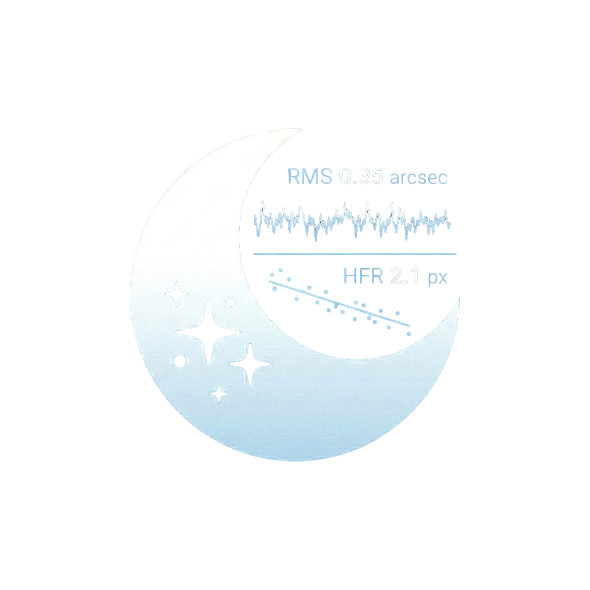 ESP32-P4 NINA Display
</h1>

<p align="center">
  <a href="https://github.com/chvvkumar/ESP32-P4-NINA-Display/actions/workflows/build.yml?query=branch%3Amain"></a>
  <a href="https://github.com/chvvkumar/ESP32-P4-NINA-Display/actions/workflows/build.yml?query=branch%3Adev"></a>
</p>

<p align="center">
  <a href="https://github.com/chvvkumar/ESP32-P4-NINA-Display/releases/latest"></a>
  <a href="https://github.com/espressif/esp-idf/tree/v5.5.2"></a>
  <a href="https://lvgl.io/"></a>
</p>

<p align="center">
  
  
  
  
</p>

A touchscreen dashboard for [N.I.N.A. astrophotography software](https://nighttime-imaging.eu/), built for the Waveshare ESP32-P4-WIFI6-Touch-LCD-4B (720x720). It polls the [ninaAPI Advanced plugin](https://github.com/christian-photo/ninaAPI) over HTTP and WebSocket and shows live session data for up to three NINA computers: exposure arcs, guiding RMS, filter status, sequence progress, power draw, and a Summary page across all instances. Beyond NINA it runs a clock page with weather, a full-screen 3D moon page, a Spotify Now Playing screen, an AllSky environmental panel, GOES satellite, Solar and custom image pages, an animated Weather Radar loop, a Cloud Cover satellite loop, JSON Display and Home Assistant tile pages, an OctoPrint 3D printer page, and an ADS-B page for aircraft overhead. Voice alerts through the onboard speaker announce threshold breaches, connection changes and session events.

<table align="center">
  <tr>
    <td align="center">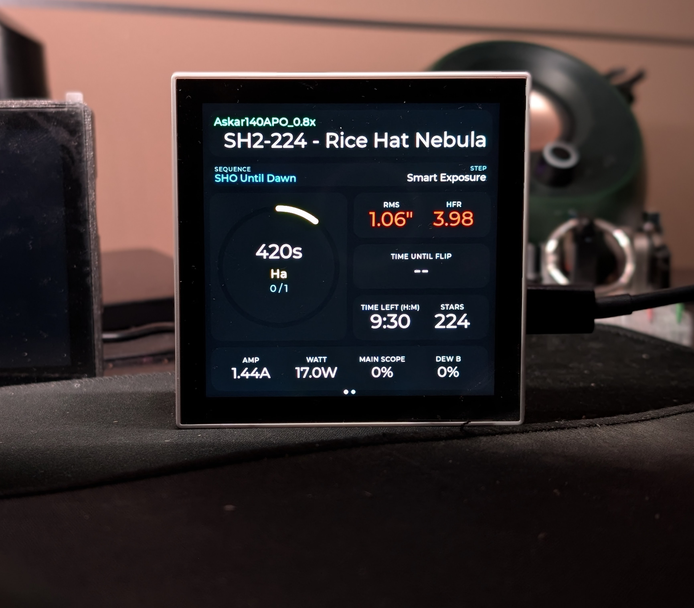</td>
    <td align="center">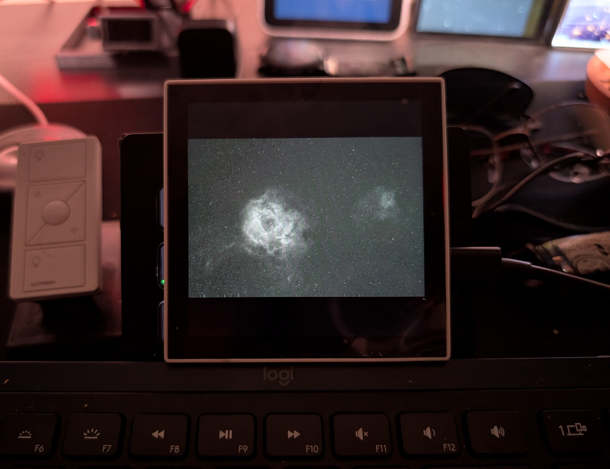</td>
  </tr>
</table>

## Table of Contents

- [Hardware](#hardware)
- [Installation](#installation)
- [First-Time Setup](#first-time-setup)
- [Security](#security)
- [Telemetry](#telemetry)
- [Pages](#pages)
  - [Summary and NINA Instance Pages](#summary-and-nina-instance-pages)
  - [Clock and Weather](#clock-and-weather)
  - [Moon](#moon)
  - [Spotify](#spotify)
  - [AllSky](#allsky)
  - [GOES Satellite](#goes-satellite)
  - [Solar](#solar)
  - [Custom Image URL](#custom-image-url)
  - [Weather Radar](#weather-radar)
  - [Cloud Cover](#cloud-cover)
  - [JSON Display](#json-display)
  - [Home Assistant](#home-assistant)
  - [OctoPrint](#octoprint)
  - [ADS-B](#ads-b)
  - [On-Device Settings and System Info](#on-device-settings-and-system-info)
- [Navigation and Home Page](#navigation-and-home-page)
- [Themes](#themes)
- [Notifications and Voice Alerts](#notifications-and-voice-alerts)
- [Web UI](#web-ui)
- [Web API](#web-api)
- [Power and Display](#power-and-display)
- [Diagnostics](#diagnostics)
- [Building from Source](#building-from-source)
- [Troubleshooting](#troubleshooting)
- [Acknowledgements](#acknowledgements)

## Hardware

- [Waveshare ESP32-P4-WIFI6-Touch-LCD-4B](https://www.waveshare.com/esp32-p4-wifi6-touch-lcd-4b.htm?sku=31416): currently the only tested board. The layout is tuned for its 720x720 display.
- [3D Printed Stand](https://www.thingiverse.com/thing:7321463) (optional): a printable stand for the display, designed by [@chicago925](https://github.com/chicago925) ([#116](https://github.com/chvvkumar/ESP32-P4-NINA-Display/issues/116)).
- [3D Printed Mount](https://www.printables.com/model/1784141-waveshare-esp32-p4-wifi6-touch-lcd-4b-mount) (optional): a printable desk mount for the display, designed by the author.

<p align="center">
  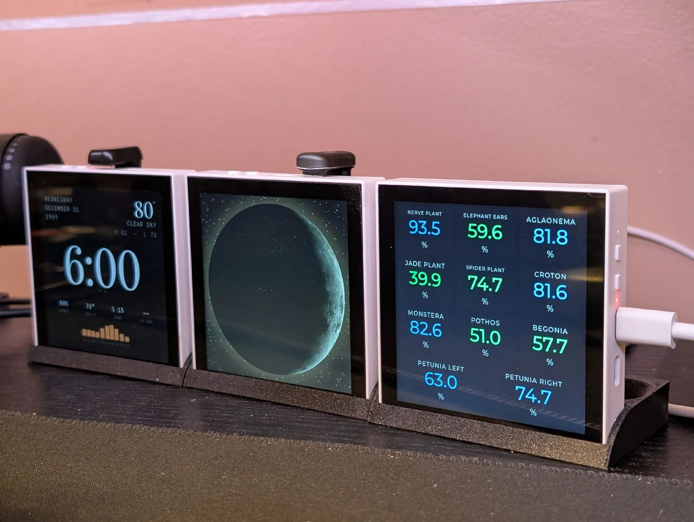
</p>

## Installation

1. On the N.I.N.A. PC, install the [ninaAPI Advanced plugin](https://github.com/christian-photo/ninaAPI) by Christian Palm from the N.I.N.A. plugin manager and enable it. The display cannot work without it.

<p align="center">
  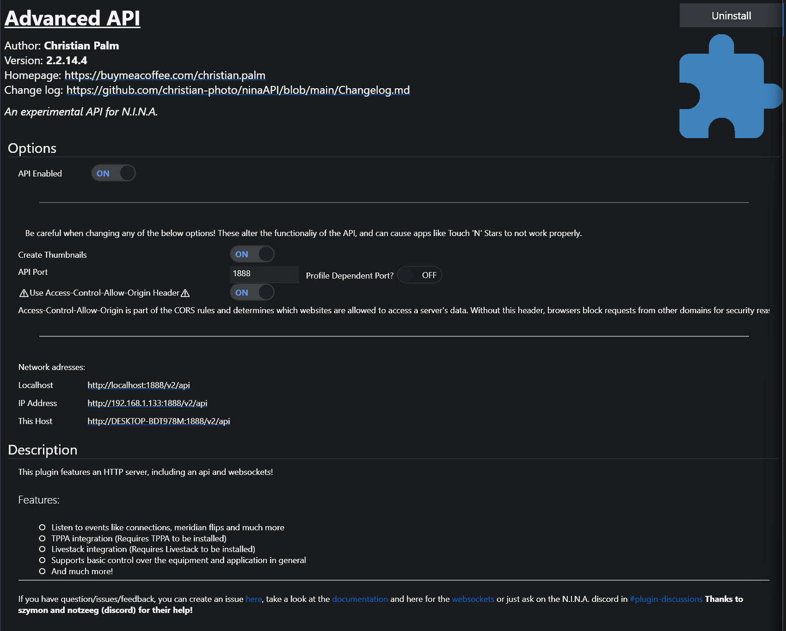
</p>

2. Download `nina-display-factory.bin` from the [Releases page](https://github.com/chvvkumar/ESP32-P4-NINA-Display/releases). No build environment is needed: open the [ESP Web Flasher](https://espressif.github.io/esptool-js/) in a Chromium-based browser, connect the board over USB, and flash the file at address `0x0000`. Each release lists the firmware files and the flashing address.

3. Later updates arrive over the air: Device > System > Firmware checks GitHub releases on a chosen channel (stable, pre-release or alpha) and installs them, or flashes a `.bin` you upload from your computer. If a new firmware fails to boot, the bootloader rolls back to the previous one.

> [!NOTE]
> If the board warns about outdated esp-hosted co-processor firmware, flash [`firmware/merged-flash.bin`](firmware/) to the ESP32-P4 at address `0x0000`. It updates the ESP32-C6 WiFi co-processor over the internal link and shows progress on screen. When it finishes, flash `nina-display-factory.bin` again.

## First-Time Setup

1. On first boot, while no WiFi network is saved, the device broadcasts an access point named after its hostname (default `NINA-DISPLAY`, password `12345678`) and prints the network name, password and address on screen. Join it and open `http://192.168.4.1`.
2. The setup page asks for your WiFi network. Pick it, enter the password and select Connect; the device joins your network and shows its address and hostname on screen until you dismiss the hint.
3. Open that address, log in (see [Security](#security)), and add your NINA computers on Pages > N.I.N.A.: enter the host or IP of each PC (up to three); the page adds port 1888 and the API path for you.

The access point is only on while the station link is down. Once the device joins your network the AP switches off; it comes back if the connection drops.

## Security

The web UI is protected by a password login (default `changeme123!`, no username). Change it on first use: Device > System > Authentication > Admin Password.

- Login is required by default for every page and API endpoint except the login page, the favicon, the version endpoint and the Spotify OAuth callback; new routes are secured unless explicitly exempted. A session lasts 12 hours.
- Scripts and automation can skip the login form and send the password in an `X-Auth-Password` header on each request. Wrong passwords on either path feed the same lockout.
- WiFi and MQTT passwords, the Spotify client ID, the OctoPrint API key, the weather API key, the JSON auth header and the Home Assistant token are returned as `********` by the API; sending that placeholder back leaves the stored value unchanged.
- Transport is HTTP, not HTTPS. Treat your LAN segment as the trust boundary.

> [!WARNING]
> Login can be turned off on the System tab. With it off, every endpoint is open to anyone on the LAN, including reboot, factory reset and firmware update. Use only on trusted networks.

## Telemetry

The firmware can send an anonymous usage and crash report to the maintainer. Every collected statistic is published at https://ninadash.challa.co/, so users see exactly what the maintainer sees.

Each report contains:

- A random device ID. It is not derived from the MAC address and is regenerated on factory reset.
- Firmware tag, commit, branch, update channel and running partition.
- Boot count, uptime and last reset reason; crash reason and crash count when the last boot crashed.
- Free heap and PSRAM, CPU load, chip temperature and WiFi signal strength.
- Which optional features are enabled or disabled.

Never sent: WiFi network names, URLs, hostnames, coordinates, location names, passwords, API keys, tokens, or any other value entered on the device. The ingest server does not store IP addresses.

Defaults: fresh installs send telemetry, with a checkbox on the first-time setup screen to opt out. Devices upgraded from earlier firmware do not send anything until telemetry is enabled. Change it at any time in the System tab of the web settings page; the "Show exactly what is sent" button there displays the exact report the device would send.

## Pages

Optional pages can be enabled or disabled from the web UI; the Summary, Clock, Settings and System Info pages are always present. Data pages that talk to a server show a "Connecting to ..." state until the first successful fetch, dim with a "Reconnecting..." cue after missed polls, and switch to "Cannot Reach ..." after three misses.

### Summary and NINA Instance Pages

The Summary page shows a card for each connected NINA instance (offline instances are hidden; with none connected it shows a "No N.I.N.A. Instances Connected" message): name, active filter, target, progress, RMS, HFR, safety state and time to meridian flip; with one or two cards on screen each card also shows the sequence name, completed exposures and current step. Tap a card to jump to that instance's page.

Each instance page is a 720x720 grid: header (instance name, colored green when connected and red when not, and the current target), sequence, an animated exposure arc colored by the active filter, filter and timing, guiding RMS, HFR, star count, mount flip time, time left on the target, and power (total current, total power, and each dew-heater or PWM channel). After 30 s without fresh data a Last update label appears; after 2 minutes the page dims.

Setup: Pages > N.I.N.A. (host or IP per instance; the plugin listens on port 1888).

<p align="center">
  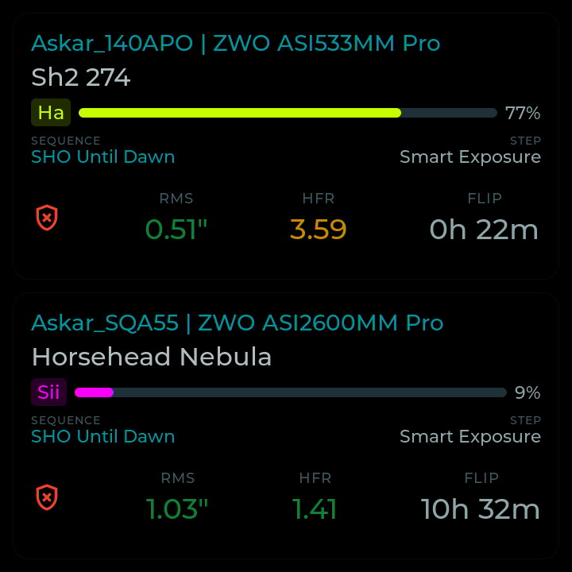
</p>

<table align="center">
  <tr>
    <td align="center">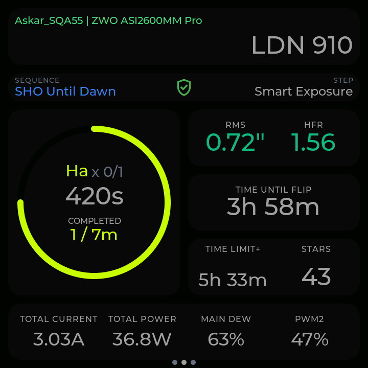</td>
    <td align="center">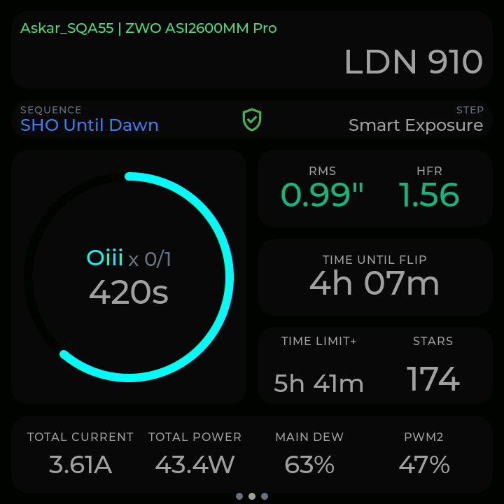</td>
  </tr>
  <tr>
    <td align="center"><em>Instance page, Ha filter</em></td>
    <td align="center"><em>Instance page, OIII filter</em></td>
  </tr>
</table>

Every section on an instance page is tappable:

| Tap area | Opens |
|---|---|
| Header | Full-screen preview of the last captured image (double-tap to cycle zoom, back button to close) |
| Sequence box | Sequence detail overlay (container, step, exposure counts) |
| Exposure arc | Camera and weather overlay (sensor, exposure, cooling and gain/offset details, plus temperature, humidity, dew point, wind, cloud and SQM from NINA's weather device) |
| Filter label (arc center) | Filter wheel overlay (current and available filters) |
| RMS box | RMS history graph (25 to 400 points, RA/Dec/Total, threshold lines) |
| HFR box (short tap) | HFR history graph (25 to 400 points, threshold lines) |
| HFR box (long press) | Autofocus overlay (V-curve, focus position) |
| Flip time box | Mount overlay (RA/Dec, altitude, azimuth, meridian flip state) |
| Time-left box | Session statistics overlay (exposures, integration time, efficiency, RMS and HFR average/best/worst, session duration) |
| Stars box | Image statistics overlay (star count, HFR and HFR SD, pixel mean/median/stddev/min/max, capture settings, camera and telescope) |
| Power row | Jump back to the Summary page |

<table align="center">
  <tr>
    <td align="center">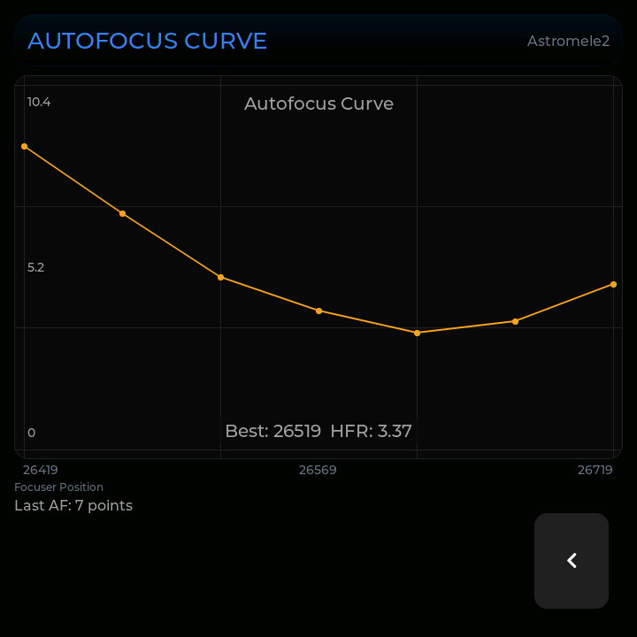</td>
    <td align="center">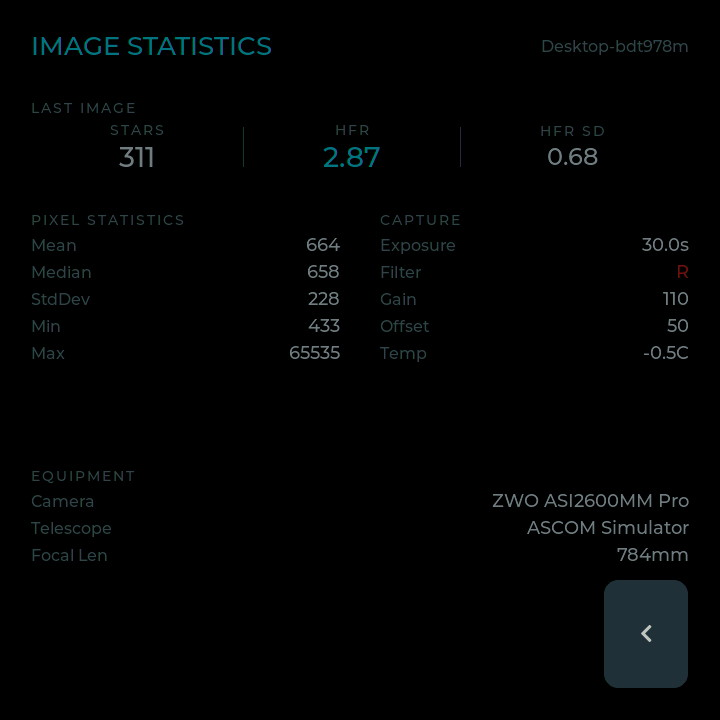</td>
  </tr>
  <tr>
    <td align="center"><em>Autofocus overlay</em></td>
    <td align="center"><em>Image statistics overlay</em></td>
  </tr>
  <tr>
    <td align="center">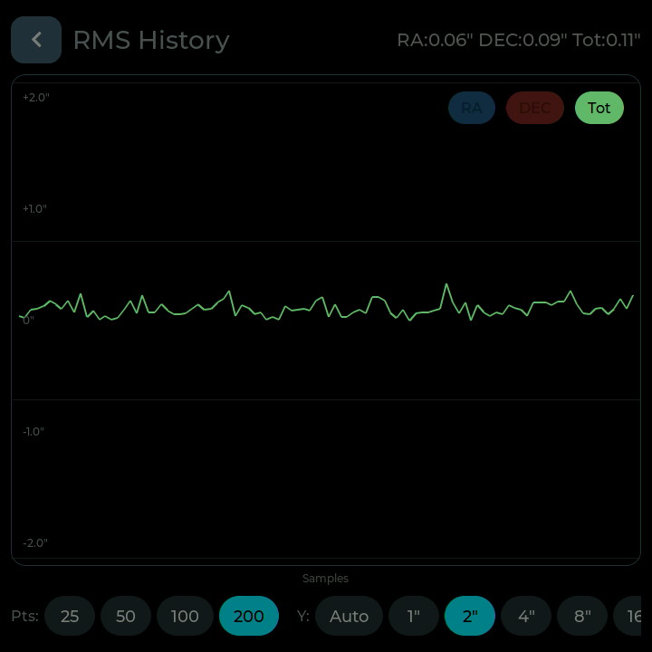</td>
    <td align="center">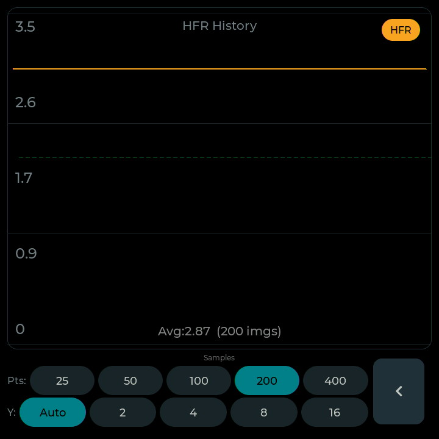</td>
  </tr>
  <tr>
    <td align="center"><em>RMS history graph</em></td>
    <td align="center"><em>HFR history graph</em></td>
  </tr>
</table>

Polling: the visible instance is polled every 5 s by default (1-10 s); the others get a 10 s heartbeat. The Summary page polls all instances at full rate; non-NINA pages drop every instance to a slow idle poll.

---

### Clock and Weather

The Clock page shows a large digital clock with current conditions, high and low, humidity, dew point, wind, UV, and a 10-hour forecast from your chosen provider.

Setup: Pages > Clock (weather provider: Open-Meteo needs no key; OpenWeatherMap and Weather Underground need an API key). The location comes from Device > System > Location.

<p align="center">
  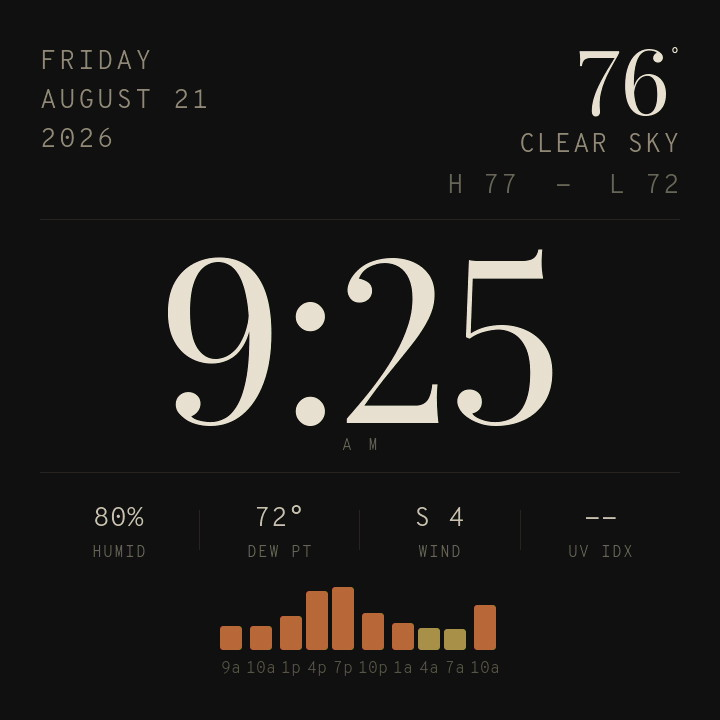
</p>

<table align="center">
  <tr>
    <td align="center">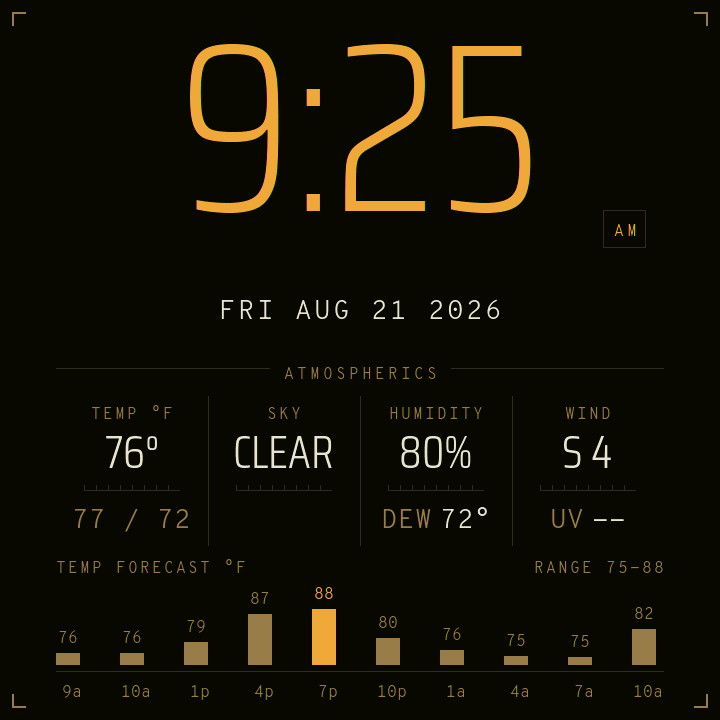</td>
    <td align="center">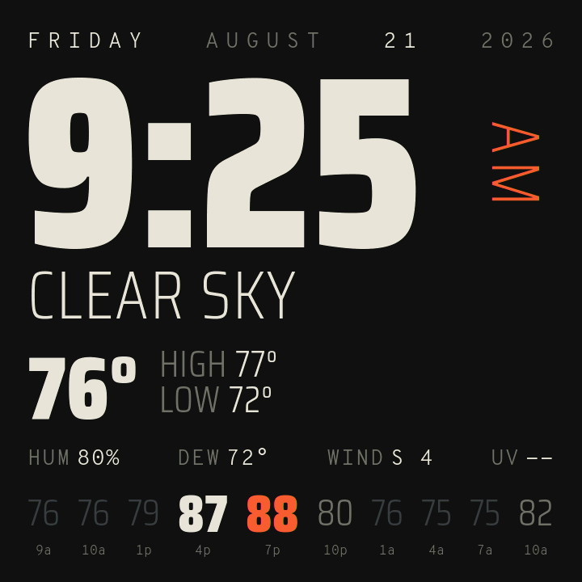</td>
  </tr>
  <tr>
    <td align="center"><em>Console 92</em></td>
    <td align="center"><em>Broadside</em></td>
  </tr>
  <tr>
    <td align="center">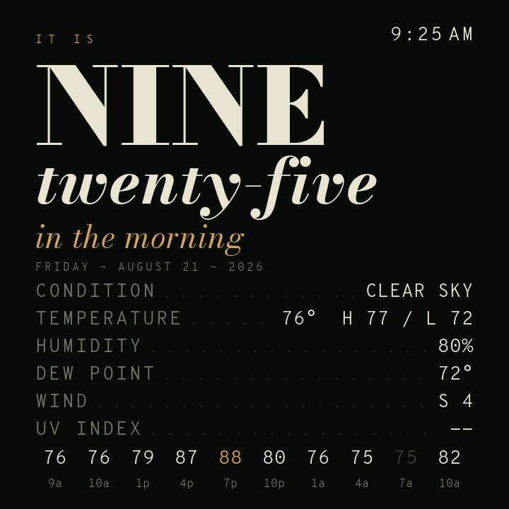</td>
    <td align="center">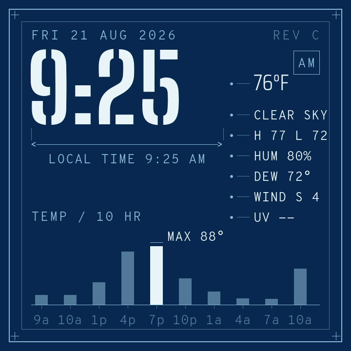</td>
  </tr>
  <tr>
    <td align="center"><em>Evensong</em></td>
    <td align="center"><em>Blueprint</em></td>
  </tr>
  <tr>
    <td align="center">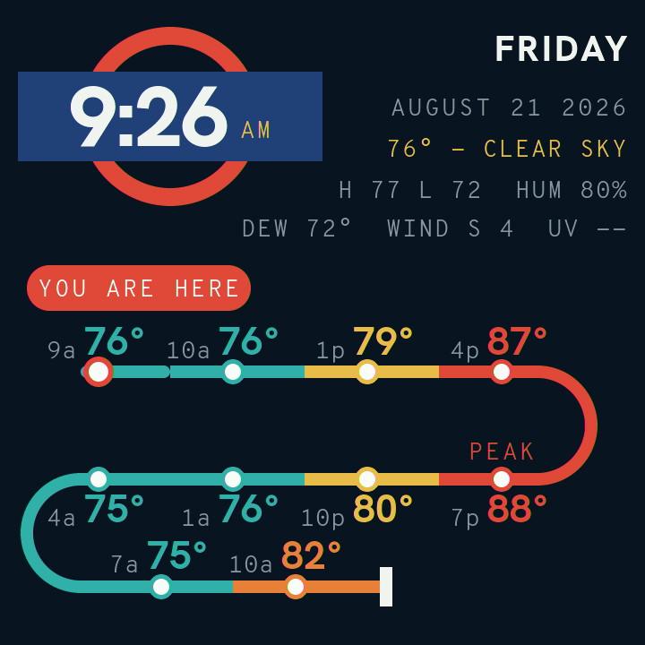</td>
    <td align="center">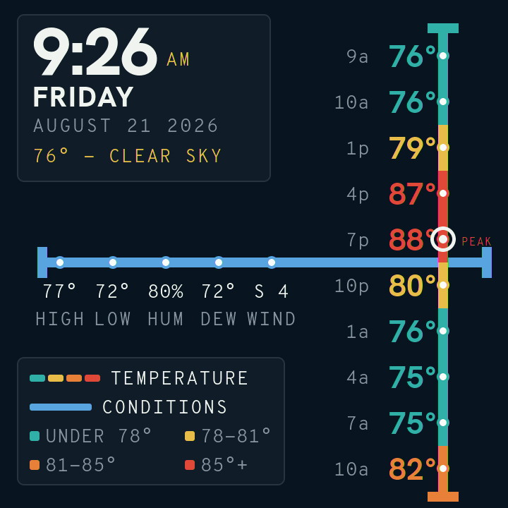</td>
  </tr>
  <tr>
    <td align="center"><em>Transit Line</em></td>
    <td align="center"><em>Night Network</em></td>
  </tr>
</table>

### Moon

The Moon page renders the Moon on the device with the current phase, libration and sub-solar lighting; drag it to look around, and pick a starfield or glow background.

Setup: Pages > Moon. The location comes from Device > System > Location.

<table align="center">
  <tr>
    <td align="center">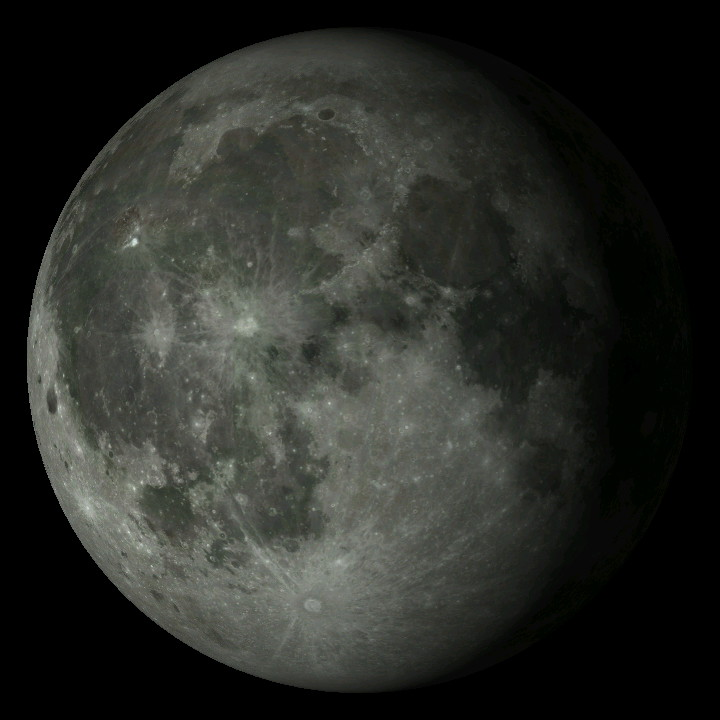</td>
    <td align="center">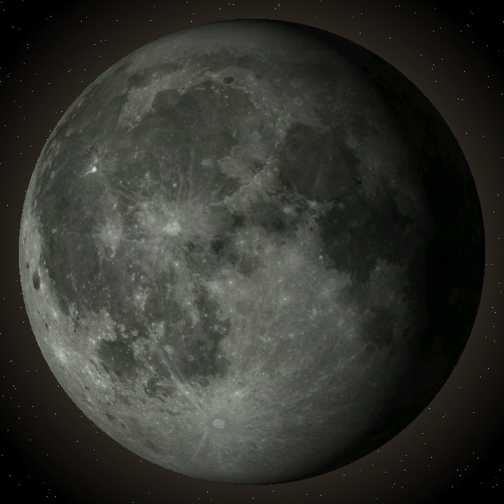</td>
  </tr>
  <tr>
    <td align="center"><em>Plain black background</em></td>
    <td align="center"><em>Starfield + Glow background</em></td>
  </tr>
</table>

---

### Spotify

A full-screen Now Playing page with album art, track and artist, progress bar, and playback controls that appear on tap. Data comes from the Spotify Web API through your own Spotify developer app.

Setup: Pages > Spotify. You need a free app at [developer.spotify.com](https://developer.spotify.com) with the redirect URI `http://127.0.0.1:8000/callback`; the tab walks you through the login.

<table align="center">
  <tr>
    <td align="center">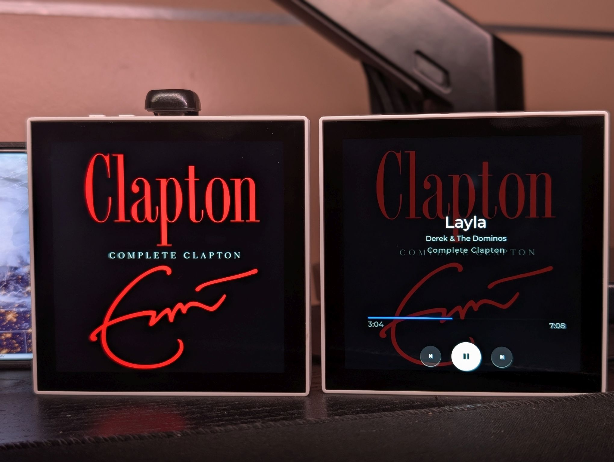</td>
    <td align="center">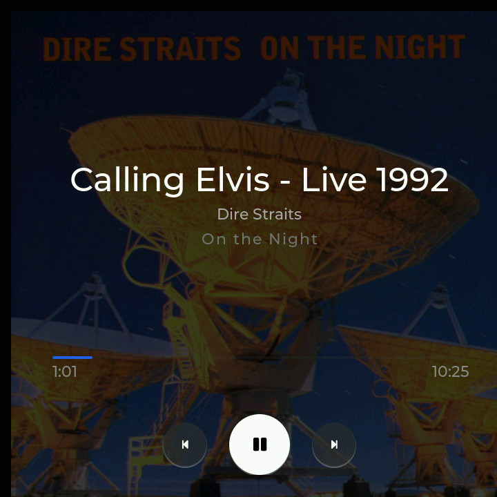</td>
  </tr>
  <tr>
    <td align="center"><em>Now Playing</em></td>
    <td align="center"><em>Controls overlay</em></td>
  </tr>
</table>

---

### AllSky

A four-quadrant environmental panel (thermal, sky quality, ambient, power) fed from an AllSky camera. The data comes from [AllSkyExtraVarsREST](https://github.com/chvvkumar/AllSkyExtraVarsREST), a small FastAPI service you install on the AllSky Raspberry Pi; it serves the AllSky overlay extra-variable JSON files (star count, exposure, temperatures, weather, planets and moon) over HTTP on port 8080, and the display reads its `/all` endpoint. Each quadrant maps to fields of that JSON, with thresholds that color the readings.

Setup: install AllSkyExtraVarsREST on the AllSky Pi (`bash install.sh`), then Pages > AllSky (host and port of that service, for example `allskypi5.lan:8080`; the tab fetches the field list and lets you map it to the quadrants).

<p align="center">
  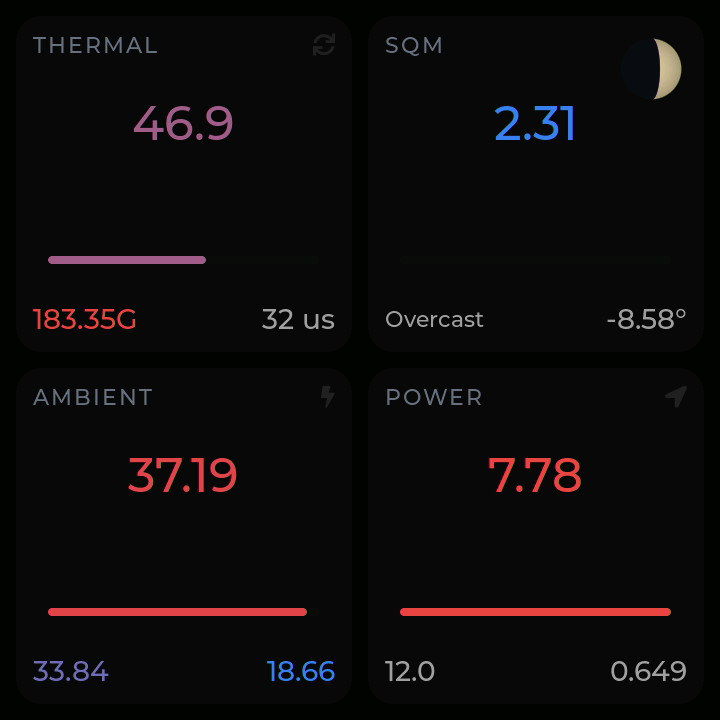
</p>

---

### GOES Satellite

Full-screen GOES satellite imagery for a chosen region, refreshed on an interval, with optional caption, crop, rotation and flip.

Setup: Pages > GOES.

<p align="center">
  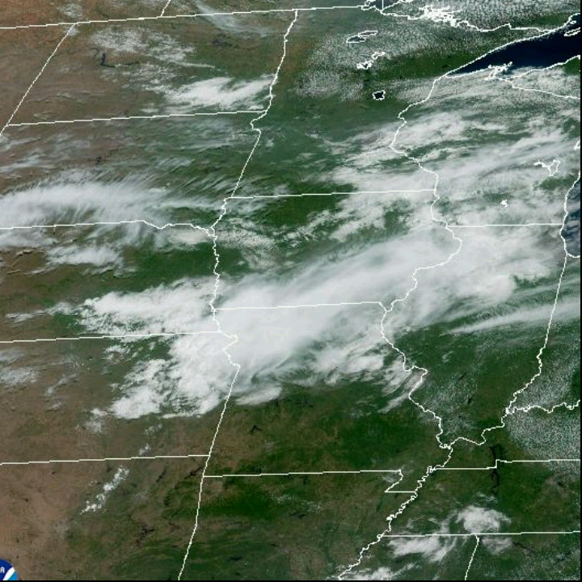
</p>

---

### Solar

Full-screen solar imagery in a chosen band: NASA SDO and SOHO (AIA wavelengths, HMI continuum and magnetogram, LASCO coronagraphs, EIT) or the NOAA GOES SUVI extreme-UV channels.

Setup: Pages > Solar.

<p align="center">
  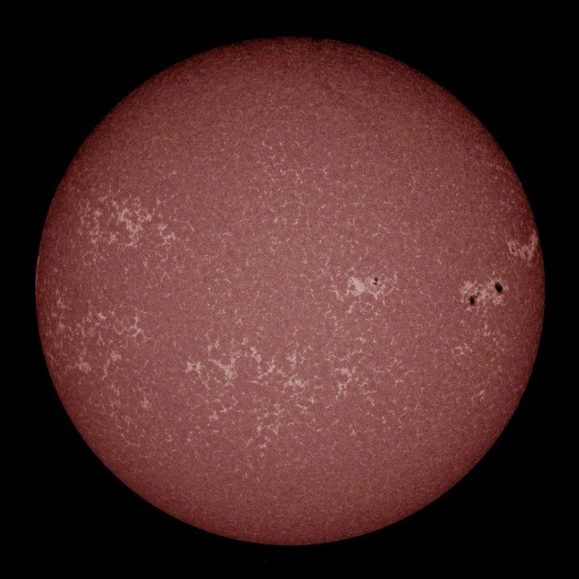
</p>

---

### Custom Image URL

Full-screen JPEG fetched from any URL you supply, for example a webcam or a weather map. JPEG only, up to 1024x1024 pixels and 1 MB; PNG and WebP are not supported. A source behind a login can be reached by entering one request header line, such as `Authorization: Bearer <token>` or `X-Api-Key: <key>`; the value is stored on the device and shown masked in the web UI.

Setup: Pages > Custom Image.

---

### Weather Radar

An animated NWS radar loop (up to 10 frames) for a chosen radar site, a region, the whole CONUS, or the nearest site to your location. The map style picks what the echoes are drawn over: the standard NWS picture with roads and city names, state lines only (the default), or state and county lines. The two line-only styles remove roads and labels, which helps when highway markings look like heavy rain; on those two styles a few sites publish no frame history and show a still picture instead of a loop.

Setup: Pages > Radar. Automatic site selection uses the location on Device > System.

<p align="center">
  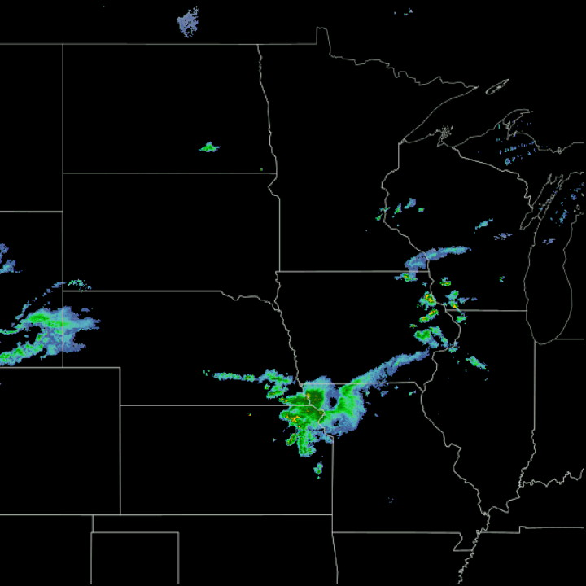
</p>

---

### Cloud Cover

An animated satellite loop of the cloud cover around your location, from NOAA GOES imagery served by NASA. Day: true color. Night: infrared clouds over city lights. State and country borders and major roads are drawn over the picture. The satellite (GOES-East or GOES-West) is picked from your longitude. The source updates every 10 minutes and the newest frame is usually 30-45 minutes old.

Setup: Pages > Cloud Cover (satellite channel, area from about 150 km to 2500 km across, up to 10 frames). The channel selects GeoColor natural color, clean infrared (cloud tops day and night) or air mass (color-coded temperature and moisture). The location comes from Device > System > Location.

<p align="center">
  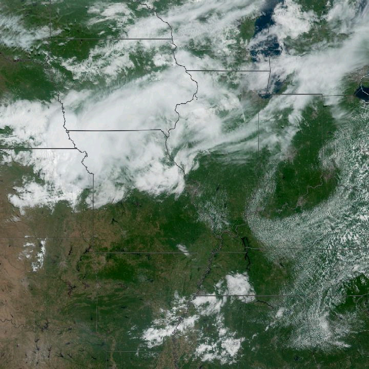
</p>

---

### JSON Display

A tile grid over any JSON document reachable by URL: each tile shows one value picked from the response, with a label and unit.

Setup: Pages > JSON (URL and optional auth header; the tab fetches a live response, lets you build the tile layout and previews it on the device).

<p align="center">
  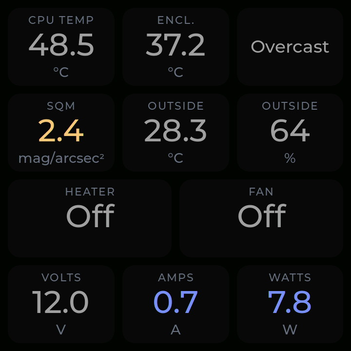
</p>

---

### Home Assistant

A tile grid over Home Assistant entity states, fetched per entity from the HA REST API. This is separate from the MQTT integration described under [Web UI](#mqtt-and-home-assistant-discovery), which publishes the display's own controls to Home Assistant.

Setup: Pages > Home Assistant (base URL and a long-lived access token; the tab tests the connection and previews the tile layout on the device).

---

### OctoPrint

Shows the current print from an OctoPrint server: progress, time elapsed, time remaining, and nozzle and bed temperatures; layer count and estimated finish appear when OctoPrint has the DisplayLayerProgress plugin. Choose one of four layouts. The picture is either the thumbnail embedded in the G-code file (needs the PrusaSlicer Thumbnails plugin in OctoPrint) or a snapshot from the printer camera. The display only reads from OctoPrint; it never sends commands to the printer.

Setup: Pages > OctoPrint (server address; approve the display from OctoPrint or paste an API key).

<p align="center">
  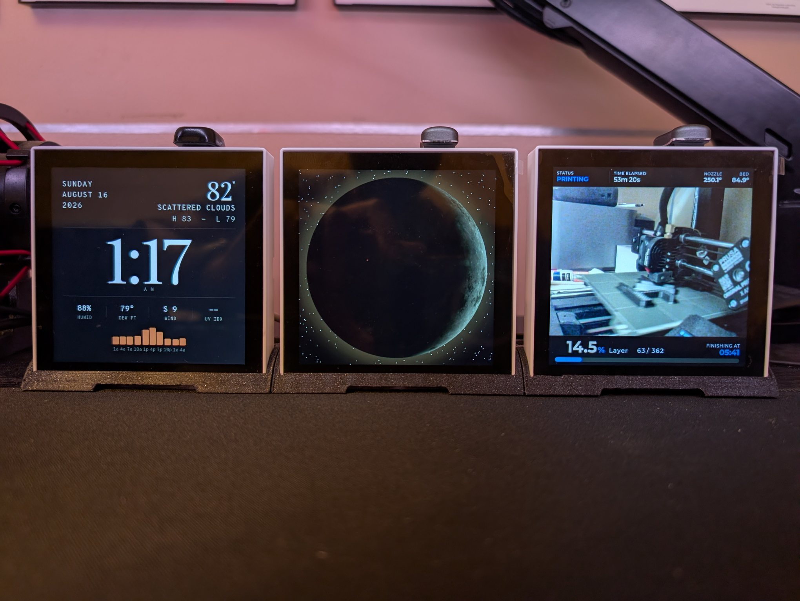
</p>

<table align="center">
  <tr>
    <td align="center">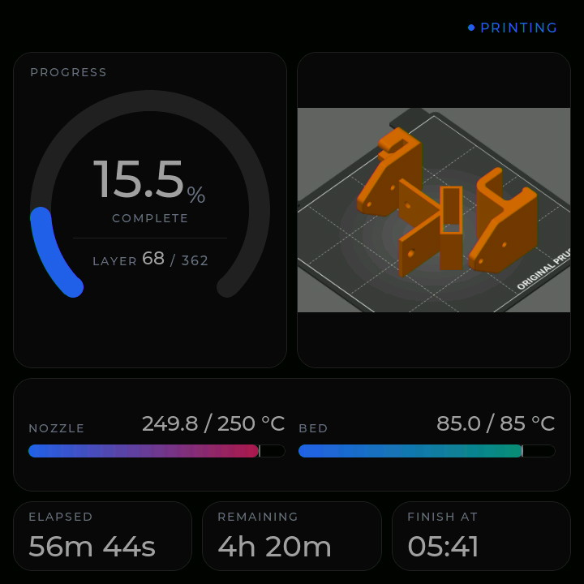</td>
    <td align="center">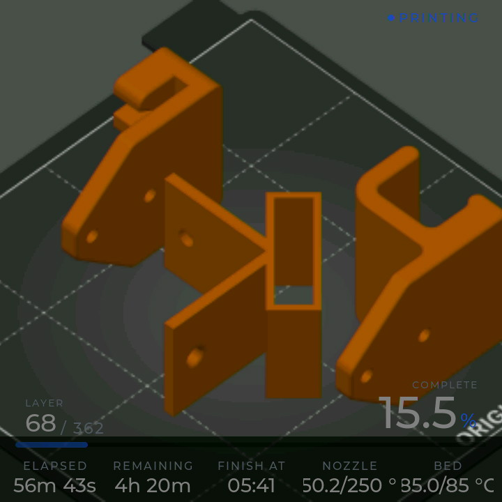</td>
  </tr>
  <tr>
    <td align="center"><em>Grid</em></td>
    <td align="center"><em>Immersive image</em></td>
  </tr>
  <tr>
    <td align="center">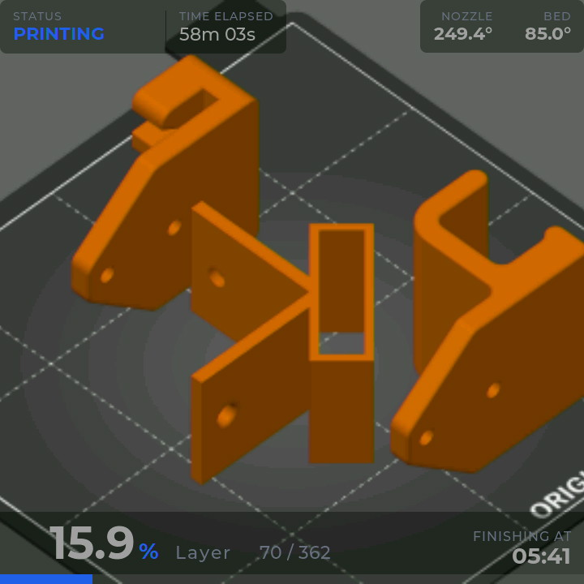</td>
    <td align="center">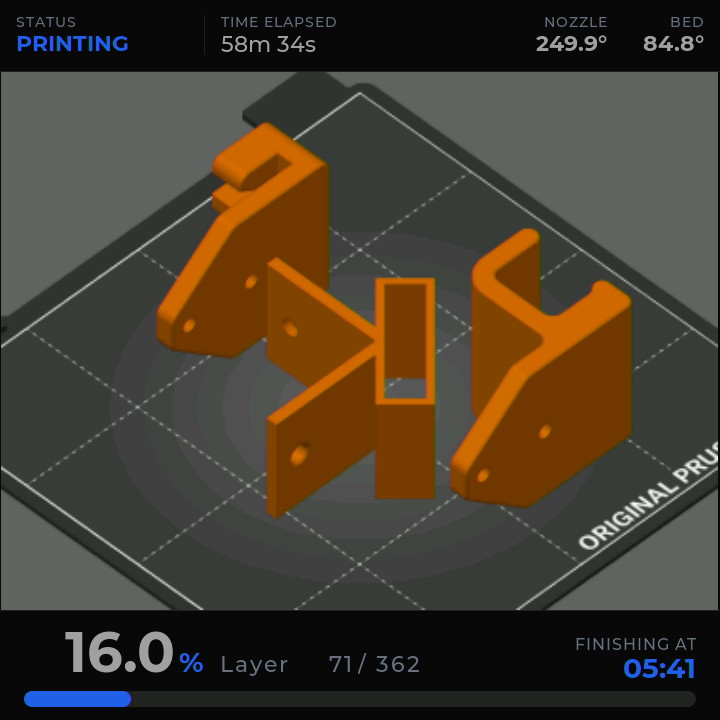</td>
  </tr>
  <tr>
    <td align="center"><em>Floating overlay</em></td>
    <td align="center"><em>Letterbox</em></td>
  </tr>
</table>

Each layout can show the printer camera instead of the slicer preview. On the Floating overlay and Letterbox layouts the nozzle and bed readings change color with what the heater is doing: warming up, holding at target, cooling down, or off; Grid and Immersive image show a heat-gradient bar instead. Tapping the page hides the readings so only the picture shows; tap again to bring them back. The change is not saved, and the Grid layout is unaffected.

---

### ADS-B

Shows the aircraft your own ADS-B receiver is hearing, with the direction each connected NINA mount is pointing marked on the same picture. Data comes from a tar1090 or readsb receiver on your network. Aircraft positions never leave your network; the only optional internet lookup is the origin-destination route for each callsign (Route lookup toggle, on by default).

<table align="center">
  <tr>
    <td align="center">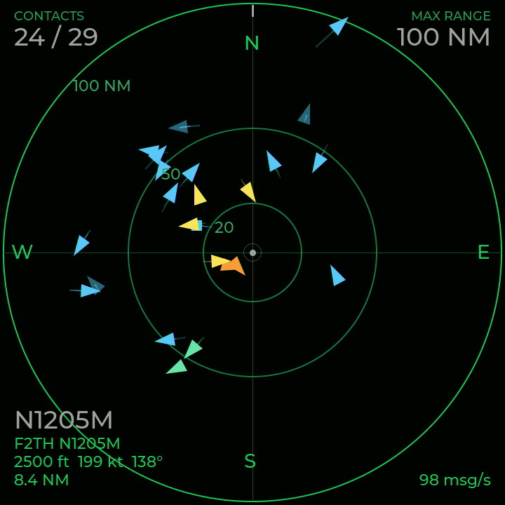</td>
    <td align="center">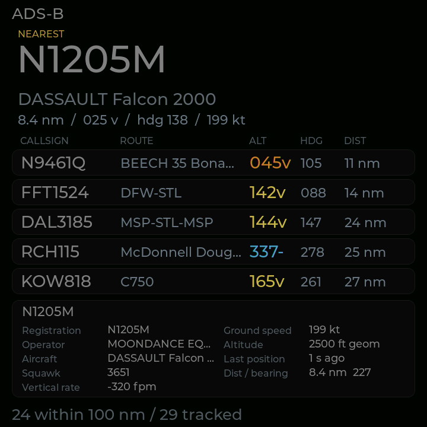</td>
  </tr>
  <tr>
    <td align="center"><em>Radar Scope</em></td>
    <td align="center"><em>Board</em></td>
  </tr>
</table>

Three views, cycled by tapping the page: Sky Dome draws the sky as seen looking up, with the middle of the circle directly overhead and the rim at the horizon; Radar Scope draws a flat map by distance out to a chosen range; Board is a text list of the nearest aircraft. The three nearest to a mount get a callsign and altitude tag. Aircraft are colored by altitude, military contacts are drawn as squares, and an emergency squawk gets a red halo. An elevation setting hides aircraft low on the horizon, where they are behind buildings and trees anyway; those are still counted.

Dragging on the Sky Dome or Radar Scope turns the whole picture so a chosen compass direction sits at the top, which lets the screen match the view out of a window. The turn is saved, and the web field and the drag stay in step.

Setup: Pages > ADS-B (receiver address such as `http://kmoofall.lan:8080`, refresh, range, minimum elevation, up direction, view, Radar Scope labels: all aircraft, up to a number, or none).

---

### On-Device Settings and System Info

Swipe to the Settings page for on-device configuration in four tabs: Display, Nodes, Behavior, and System (including Reboot and Factory Reset). The web UI exposes the full set of options. The System Info page reports hostname and IP addresses, WiFi signal, heap and PSRAM, chip and IDF version, uptime, and task count; CPU load and performance cards appear when Debug mode is on.

<table align="center">
  <tr>
    <td align="center">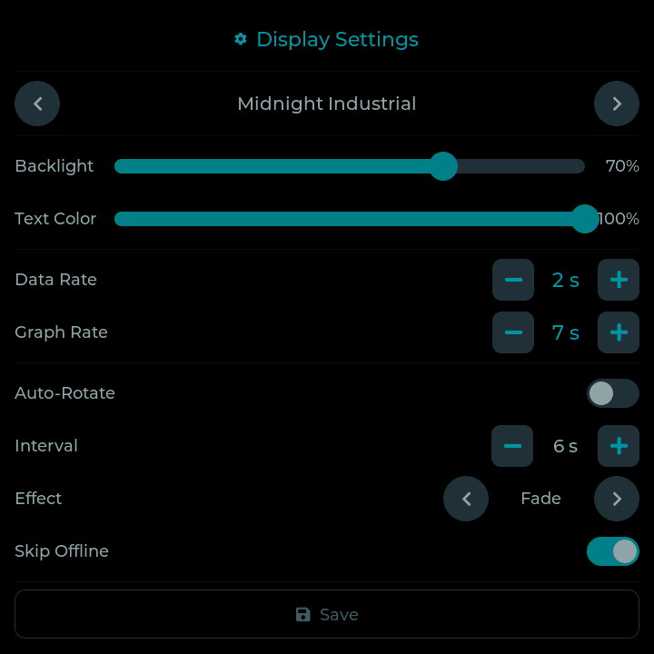</td>
    <td align="center">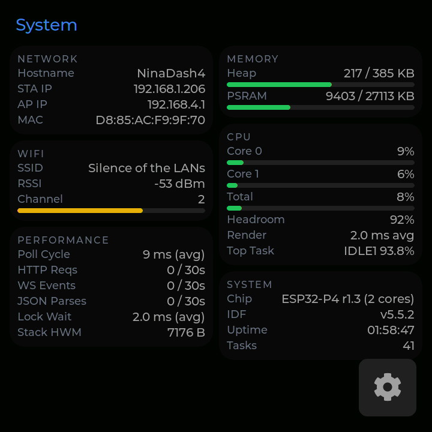</td>
  </tr>
  <tr>
    <td align="center"><em>On-device Settings</em></td>
    <td align="center"><em>System Info</em></td>
  </tr>
</table>

## Navigation and Home Page

Swipe left or right to change pages, or press the BOOT button on the board to advance (it skips the Settings page). Page-indicator dots at the bottom mark the NINA instance pages.

The display picks a page on its own; a swipe or tap takes over for a configurable time (default 10 s), after which it returns to its automatic choice. Device > Behavior > Page Navigation holds the controls:

- Home Page: the page the display settles on when nothing else applies. When it is a NINA instance, the display also returns there whenever that instance is online; with several online and the Home instance not among them, it shows the Summary page. An option keeps the Home Page on screen even while instances are connected.
- Auto Cycle: rotate through a chosen, ordered list of pages on an interval with an instant, fade or slide transition, optionally skipping disconnected instances. The downloading image pages (GOES, Solar, Custom Image, Radar and Cloud Cover) fetch a fresh picture each time the rotation reaches them.
- Switch page when no connections: show a chosen page while every enabled NINA instance is disconnected.

The web Home page and the API can also send the display to any page; see [Web API](#web-api).

## Themes

Nine built-in dark themes and 13 widget styles, selectable on Device > Display; changes apply instantly. A text brightness slider dims all theme colors for dark-site use, separately from the backlight. The Red Night theme also recolors the image pages, including the radar and cloud loops.

Filter colors are set per instance on Pages > N.I.N.A.; new filters reported by NINA are added automatically with a default color. RMS and HFR threshold colors are configurable there too, so out-of-range values shift green to amber to red on the page and in the graphs.

## Notifications and Voice Alerts

Toast pop-ups report equipment connects and disconnects, sequence, focuser, mount, meridian flip, guider, safety, error, profile, dome and flat device events, with an event history available at `/api/events`. Device > Behavior > Notifications sets the duration, border flash alerts on RMS, HFR or safety breaches, burst aggregation, and per-category pop-up and voice toggles.

<table align="center">
  <tr>
    <td align="center">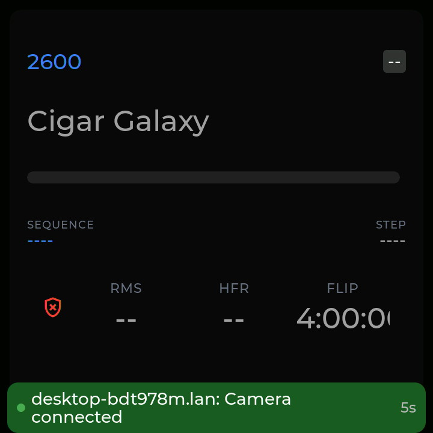</td>
    <td align="center">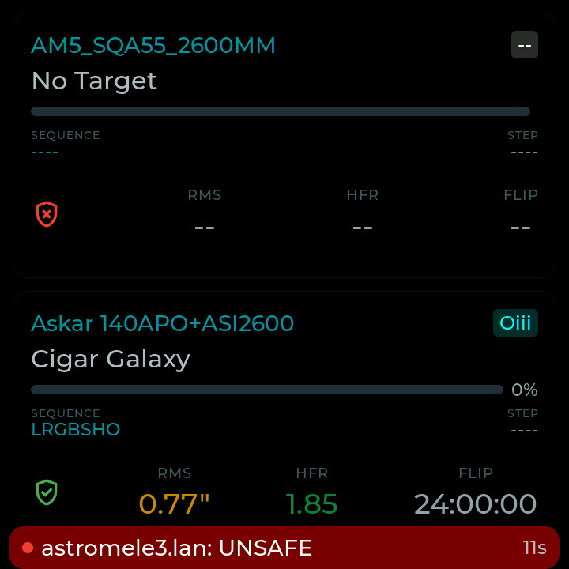</td>
  </tr>
  <tr>
    <td align="center"><em>Camera connected</em></td>
    <td align="center"><em>Safety monitor unsafe</em></td>
  </tr>
</table>

Voice alerts speak through the onboard speaker using pre-rendered clips, so no network or cloud service is involved. Three sources feed them: RMS, HFR and safety threshold breaches ("Warning, NINA one, HFR, two point five, above limit"), NINA connect and disconnect announcements, and the twelve event categories above ("NINA two, Camera, disconnected"). All are on by default on a fresh install (devices upgraded from older firmware keep their previous voice settings); volume, a brief phrasing, repeat interval and per-category toggles live on Device > Behavior, and each NINA instance can be muted separately.

Custom voice clips: Device > Voice Clips lets you replace any of the 47 built-in clips (chime, startup jingle, "NINA one/two/three", digits, equipment names, event phrases) with your own recordings; upload mp3, m4a, wav or ogg and the browser converts them. Clips survive firmware updates. Limits: 10 seconds per clip, 15 seconds for the startup jingle, 4 MB in total.

## Web UI

Open the device's address in a browser. The Home page shows device health at a glance, explains why the panel is on its current page, lists NINA connections and integrations, and lets you send the panel to any enabled page with one tap. Every setting is managed from `/config`, organized into three sections: Pages (N.I.N.A., AllSky, JSON, Home Assistant, Clock, Spotify, GOES, Moon, Solar, Custom Image, Radar, Cloud Cover, OctoPrint, ADS-B), Device (Display, Behavior, Voice Clips, System) and Tools (Logs, Backup, API). Most settings cards carry an info button that explains what those settings do. Changes apply to the display as a live preview and persist when you select Save.

<p align="center">
  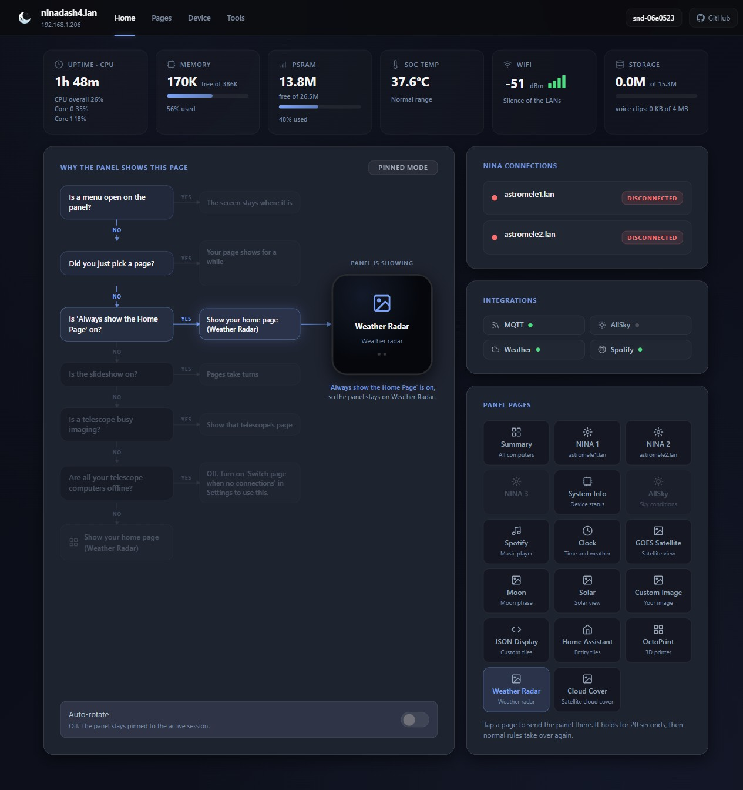
</p>

<table align="center">
  <tr>
    <td align="center">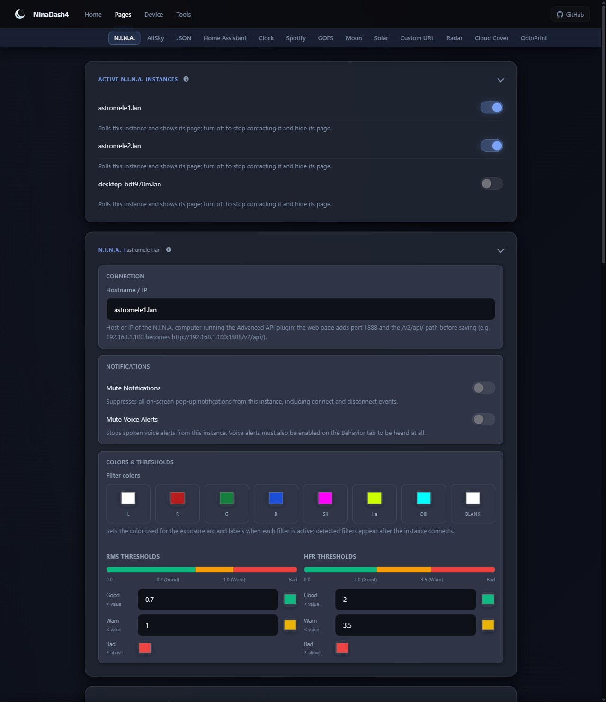</td>
    <td align="center">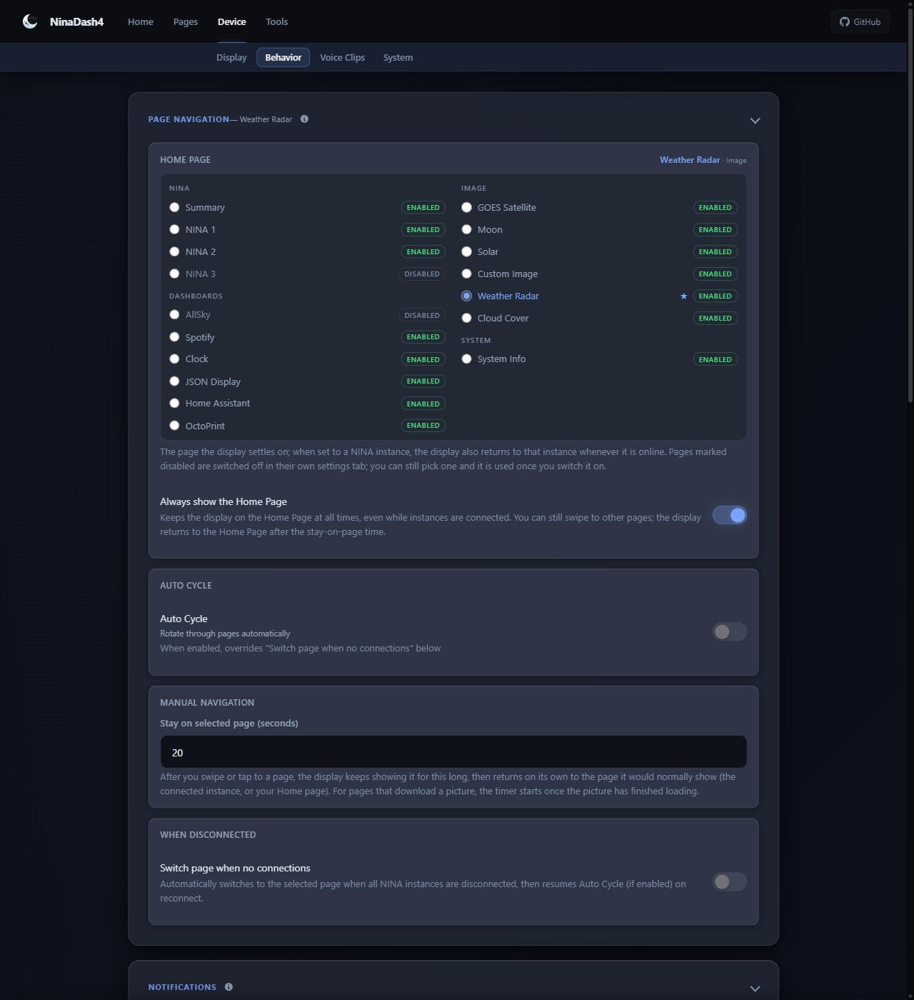</td>
  </tr>
  <tr>
    <td align="center"><em>Pages > N.I.N.A.</em></td>
    <td align="center"><em>Device > Behavior</em></td>
  </tr>
  <tr>
    <td align="center" colspan="2">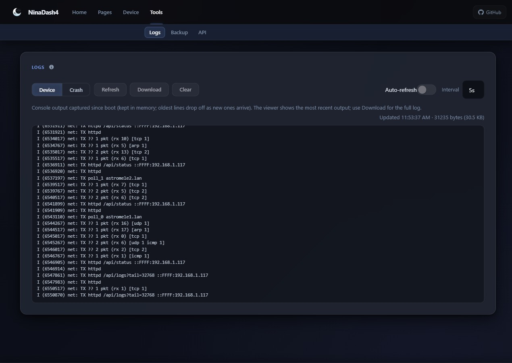</td>
  </tr>
  <tr>
    <td align="center" colspan="2"><em>Tools > Logs</em></td>
  </tr>
</table>

Backup (Tools > Backup) exports the configuration as a file, restores it with per-setting checkboxes, and can pull settings straight from another display on the network.

### MQTT and Home Assistant Discovery

Device > System > MQTT points the display at your broker. It publishes its own state with Home Assistant auto-discovery: screen brightness and text brightness as dimmable lights, a reboot button, an uptime sensor and an availability topic. Home Assistant can then set brightness or reboot the device, for example dimming during a dark-site session. NINA session data is not published over MQTT; to show Home Assistant data on the display, use the [Home Assistant page](#home-assistant).

## Web API

The device serves an HTTP API on port 80. Tools > API in the web UI documents the main endpoints with copy-paste `curl` examples, pre-filled with your device's address. While login is enabled, requests need either the session cookie from `POST /api/login` or an `X-Auth-Password` header carrying the admin password.

Key endpoints:

- `GET /api/status`: device health (heap, PSRAM, WiFi, uptime), the current page and why it is showing, and which integrations are enabled; `GET /api/nina/status` reports the NINA connections.
- `GET /api/pages`: the page list with ids and slugs; `GET` or `POST /api/navigate?ref=<slug>` (or `?id=<id>`) sends the display to a page.
- `/api/control/list`, `get`, `toggle`, `cycle`, `set`, `adjust`: read and change brightness, theme, page and other controls from automation or a macro keypad.
- `GET /api/screenshot`: a live JPEG of the display, encoded by the ESP32-P4's hardware JPEG encoder.

```bash
curl -H "X-Auth-Password: <password>" -o screenshot.jpg http://<device-ip>/api/screenshot
```

## Power and Display

- Deep sleep (Device > System): long-press BOOT to power off, an optional wake timer, and auto power-off after an extended disconnection from all NINA instances.
- Screen sleep (Device > Display): blank the backlight after an idle timeout while the firmware keeps running; touch wakes the screen.
- Screen rotation in 90 degree steps and backlight level, applied live.
- WiFi transmit power cap (Device > System). Lowering it can cure brief teal or green screen flashes on boards whose supply sags during WiFi bursts; too low a value can make the device unreachable, so confirm the page still responds before saving.

## Diagnostics

- Tools > Logs: live device log, crash log (reboot reasons and panics) and core dump download. Raw endpoints: `/api/logs`, `/api/crashlog`, `/api/coredump`.
- `GET /api/events`: recent event history (severity, instance, message).
- Debug mode (Device > System) turns on the performance monitor and `GET /api/perf` (HTTP, JSON and UI latencies, memory, CPU load).
- Demo mode generates simulated session data so the pages can be exercised without a live NINA connection.

## Building from Source

Standard ESP-IDF 5.5.2 project: activate the IDF environment and run `idf.py build`, or use `build_firmware.ps1` on Windows to build and push an OTA update to one or more devices. See `CLAUDE.md` for the architecture, task layout and configuration conventions.

## Troubleshooting

- The `NINA-DISPLAY` access point does not appear: the AP is only on while the device has no WiFi connection. If the display is already on your network, open its address instead.
- The OTA said success but nothing changed: compare the version and behavior after reboot; a firmware that crashes or resets before it finishes booting is rolled back to the previous slot. Flash the factory binary over USB if the device stays on the old version.
- The board warns about outdated esp-hosted co-processor firmware: flash `firmware/merged-flash.bin` at `0x0000`, wait for the on-screen progress to finish, then flash the factory binary again.
- NINA shows offline although the PC is reachable: confirm the ninaAPI Advanced plugin is installed and enabled, that it listens on port 1888, and that the Windows firewall allows the port.
- Lost the admin password: on the device, swipe to Settings > System and select Factory Reset. This erases all settings.

## Acknowledgements

- [Christian Palm](https://github.com/christian-photo) for the [ninaAPI Advanced plugin](https://github.com/christian-photo/ninaAPI).
- [@chicago925](https://github.com/chicago925) for the 3D printed stand ([#116](https://github.com/chvvkumar/ESP32-P4-NINA-Display/issues/116)).
- Waveshare for the ESP32-P4-WIFI6-Touch-LCD-4B board support package.
- [LVGL](https://lvgl.io/) and [stb_image](https://github.com/nothings/stb).
- NASA GIBS for the Cloud Cover imagery, NASA SDO and SOHO for the solar imagery, NOAA GOES SUVI (rendered by Helioviewer) for the extreme-UV solar bands, NOAA and the NWS for radar and GOES imagery, and Open-Meteo, OpenWeatherMap and Weather Underground for weather data.
- Espressif esp-hosted and esp_wifi_remote for the ESP32-C6 WiFi link, [tgx](https://github.com/vindar/tgx) for the moon sphere renderer, and SVOX Pico TTS (esp-picotts) for the voice clips.
- NASA's Scientific Visualization Studio for the [CGI Moon Kit](https://svs.gsfc.nasa.gov/4720) lunar surface maps used by the Moon page (visualizer Ernie Wright, USRA; scientist Noah Petro, NASA/GSFC), built from Lunar Reconnaissance Orbiter LROC WAC and LOLA data.
